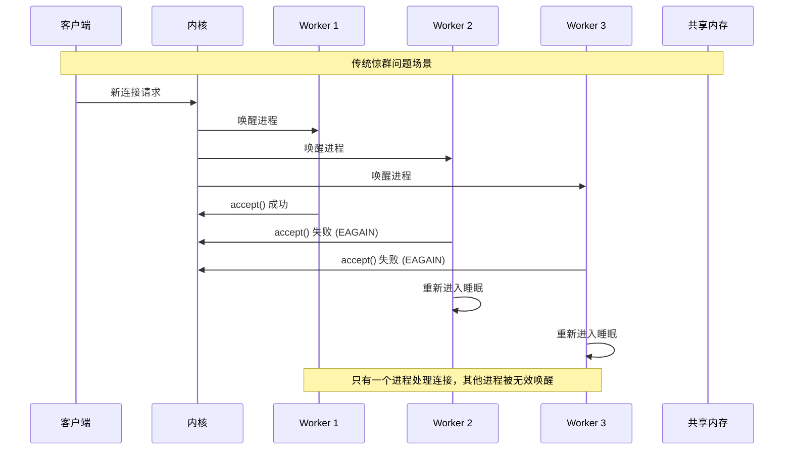
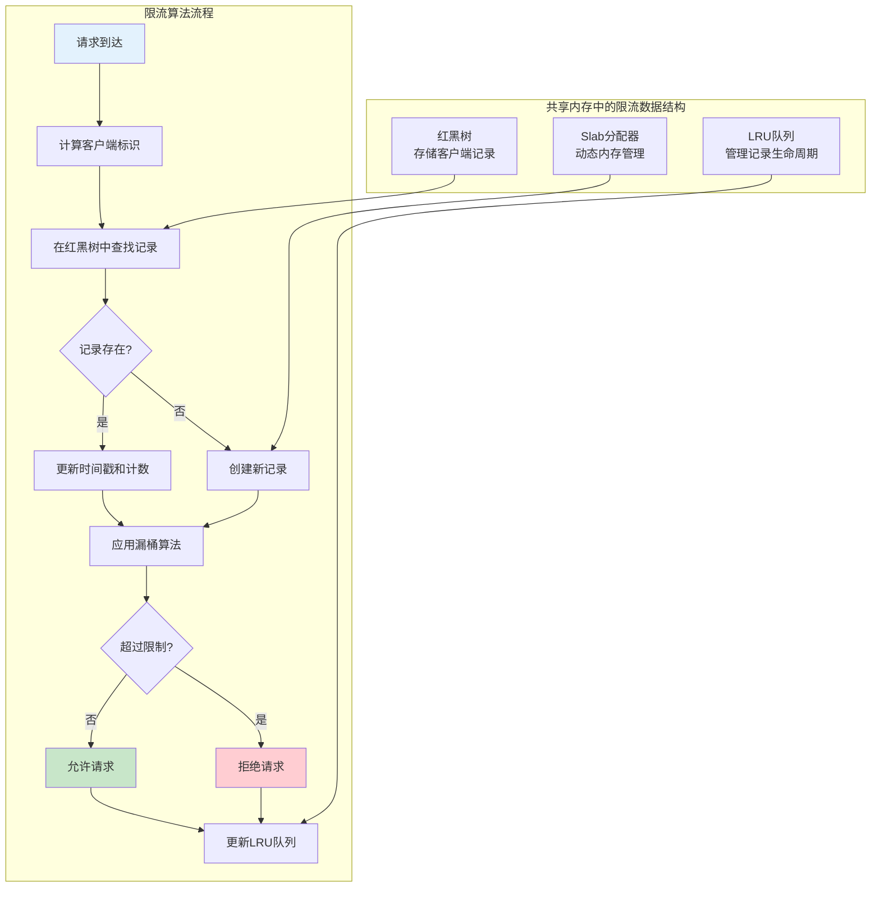
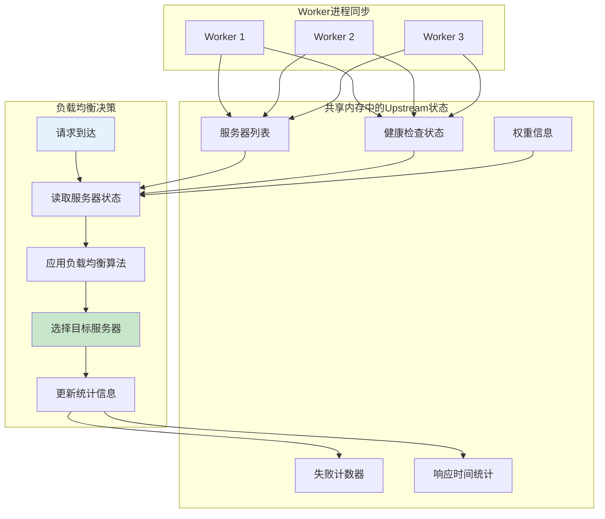

# Nginx 共享内存实际应用场景深度分析

## 概述

nginx的共享内存机制在实际应用中发挥着关键作用，支撑了众多核心功能的实现。本文将深入分析nginx共享内存在各种实际场景中的应用，包括Accept Mutex、限流控制、负载均衡、SSL会话缓存等关键功能。

## 1. Accept Mutex - 解决惊群问题

### 1.1 惊群问题的本质

在多进程web服务器中，当有新连接到达时，所有监听同一端口的worker进程都会被唤醒，但只有一个进程能够成功接受连接，其他进程会重新进入睡眠状态。这种现象称为"惊群效应"，会导致：

- **CPU资源浪费**：大量进程被无效唤醒
- **系统调用开销**：频繁的上下文切换
- **缓存污染**：进程切换导致CPU缓存失效
- **负载不均**：某些进程可能获得更多连接



### 1.2 Accept Mutex的解决方案

nginx通过Accept Mutex机制解决惊群问题，核心思想是：同一时刻只有一个worker进程监听新连接。

```c
// Accept Mutex的核心实现 - 位置：src/event/ngx_event_accept.c
void ngx_process_events_and_timers(ngx_cycle_t *cycle)
{
    ngx_uint_t  flags;
    ngx_msec_t  timer, delta;

    timer = NGX_TIMER_INFINITE;
    flags = 0;

    // 如果启用了accept mutex
    if (ngx_use_accept_mutex) {
        
        // 当前进程连接数过多时，不参与accept竞争
        if (ngx_accept_disabled > 0) {
            ngx_accept_disabled--;
        } else {
            // 尝试获取accept mutex
            if (ngx_trylock_accept_mutex(cycle) == NGX_ERROR) {
                return;
            }

            if (ngx_accept_mutex_held) {
                flags |= NGX_POST_EVENTS;  // 延迟处理事件
            } else {
                // 没有获得锁，设置较长的超时时间
                if (timer == NGX_TIMER_INFINITE
                    || timer > ngx_accept_mutex_delay)
                {
                    timer = ngx_accept_mutex_delay;
                }
            }
        }
    }

    // 处理事件
    (void) ngx_process_events(cycle, timer, flags);

    // 释放accept mutex
    if (ngx_accept_mutex_held) {
        ngx_shmtx_unlock(&ngx_accept_mutex);
    }
}

// 尝试获取accept mutex
static ngx_int_t ngx_trylock_accept_mutex(ngx_cycle_t *cycle)
{
    // 非阻塞方式尝试获取锁
    if (ngx_shmtx_trylock(&ngx_accept_mutex)) {
        
        ngx_log_debug0(NGX_LOG_DEBUG_EVENT, cycle->log, 0,
                       "accept mutex locked");

        if (ngx_accept_mutex_held && ngx_accept_events == 0) {
            return NGX_OK;
        }

        // 启用监听事件
        if (ngx_enable_accept_events(cycle) == NGX_ERROR) {
            ngx_shmtx_unlock(&ngx_accept_mutex);
            return NGX_ERROR;
        }

        ngx_accept_events = 0;
        ngx_accept_mutex_held = 1;

        return NGX_OK;
    }

    ngx_log_debug1(NGX_LOG_DEBUG_EVENT, cycle->log, 0,
                   "accept mutex lock failed: %ui", ngx_errno);

    if (ngx_accept_mutex_held) {
        // 禁用监听事件
        if (ngx_disable_accept_events(cycle, 0) == NGX_ERROR) {
            return NGX_ERROR;
        }

        ngx_accept_mutex_held = 0;
    }

    return NGX_OK;
}
```

### 1.3 负载均衡机制

Accept Mutex还实现了简单的负载均衡机制，通过`ngx_accept_disabled`变量控制：

```c
// 负载均衡控制 - 位置：src/event/ngx_event_accept.c
void ngx_event_accept(ngx_event_t *ev)
{
    // ... 接受连接的代码 ...
    
    // 更新负载均衡计数器
    ngx_accept_disabled = ngx_cycle->connection_n / 8
                          - ngx_cycle->free_connection_n;
    
    // 当连接数过多时，该进程暂时不参与accept竞争
    if (ngx_accept_disabled > 0) {
        ngx_log_debug1(NGX_LOG_DEBUG_EVENT, ev->log, 0,
                       "accept disabled: %d", ngx_accept_disabled);
    }
}
```

## 2. 限流控制 - 跨进程状态同步

### 2.1 请求频率限制 (limit_req)

limit_req模块使用共享内存实现跨worker进程的请求频率限制，采用漏桶算法：



```c
// limit_req的核心处理逻辑 - 位置：src/http/modules/ngx_http_limit_req_module.c
static ngx_int_t
ngx_http_limit_req_handler(ngx_http_request_t *r)
{
    uint32_t                     hash;
    ngx_str_t                    key;
    ngx_int_t                    rc;
    ngx_uint_t                   n, excess;
    ngx_msec_t                   now;
    ngx_queue_t                 *q;
    ngx_rbtree_node_t           *node;
    ngx_http_limit_req_ctx_t    *ctx;
    ngx_http_limit_req_node_t   *lr;
    
    // 获取限流上下文
    ctx = ngx_http_get_module_loc_conf(r, ngx_http_limit_req_module);
    
    if (ctx->shm_zone == NULL) {
        return NGX_DECLINED;
    }
    
    // 计算客户端标识
    if (ngx_http_complex_value(r, &ctx->key, &key) != NGX_OK) {
        return NGX_HTTP_INTERNAL_SERVER_ERROR;
    }
    
    if (key.len == 0) {
        return NGX_DECLINED;
    }
    
    hash = ngx_crc32_short(key.data, key.len);
    
    // 获取共享内存锁
    ngx_shmtx_lock(&ctx->shpool->mutex);
    
    // 在红黑树中查找记录
    node = ngx_http_limit_req_lookup(ctx, hash, &key, &excess, 
                                     (r->connection->log->log_level & NGX_LOG_DEBUG_HTTP));
    
    now = ngx_current_msec;
    
    if (node == NULL) {
        // 创建新记录
        n = offsetof(ngx_rbtree_node_t, color)
            + offsetof(ngx_http_limit_req_node_t, data)
            + key.len;
        
        node = ngx_slab_alloc_locked(ctx->shpool, n);
        
        if (node == NULL) {
            // 内存不足，尝试清理过期记录
            ngx_http_limit_req_expire(ctx, 1);
            
            node = ngx_slab_alloc_locked(ctx->shpool, n);
            if (node == NULL) {
                ngx_shmtx_unlock(&ctx->shpool->mutex);
                return NGX_HTTP_SERVICE_UNAVAILABLE;
            }
        }
        
        // 初始化新记录
        lr = (ngx_http_limit_req_node_t *) &node->color;
        
        node->key = hash;
        lr->len = (u_char) key.len;
        lr->excess = 0;
        
        ngx_memcpy(lr->data, key.data, key.len);
        
        // 插入红黑树
        ngx_rbtree_insert(&ctx->sh->rbtree, node);
        
        // 加入LRU队列
        ngx_queue_insert_head(&ctx->sh->queue, &lr->queue);
        
        // 设置初始时间戳
        lr->last = now;
        lr->count = 1000;  // 初始令牌数
        
        ngx_shmtx_unlock(&ctx->shpool->mutex);
        return NGX_DECLINED;
    }
    
    lr = (ngx_http_limit_req_node_t *) &node->color;
    
    // 应用漏桶算法
    excess = lr->excess;
    
    ngx_msec_t  ms = now - lr->last;
    
    if (ms < 60000) {
        // 计算新的令牌数
        lr->excess = excess - ctx->rate * ms / 1000 + 1000;
        
        if (lr->excess < 0) {
            lr->excess = 0;
        }
        
    } else {
        lr->excess = 0;
    }
    
    lr->last = now;
    
    // 更新LRU队列
    ngx_queue_remove(&lr->queue);
    ngx_queue_insert_head(&ctx->sh->queue, &lr->queue);
    
    ngx_shmtx_unlock(&ctx->shpool->mutex);
    
    // 判断是否超过限制
    if (lr->excess > ctx->burst) {
        ngx_log_error(ctx->limit_log_level, r->connection->log, 0,
                      "limiting requests, excess: %ui.%03ui by zone \"%V\"",
                      lr->excess / 1000, lr->excess % 1000,
                      &ctx->shm_zone->shm.name);
        
        return NGX_HTTP_SERVICE_UNAVAILABLE;
    }
    
    return NGX_DECLINED;
}
```

### 2.2 连接数限制 (limit_conn)

limit_conn模块使用类似的机制限制并发连接数：

```c
// limit_conn的处理逻辑 - 位置：src/http/modules/ngx_http_limit_conn_module.c
static ngx_int_t
ngx_http_limit_conn_handler(ngx_http_request_t *r)
{
    size_t                       n;
    uint32_t                     hash;
    ngx_str_t                    key;
    ngx_uint_t                   i;
    ngx_rbtree_node_t           *node;
    ngx_http_limit_conn_ctx_t   *ctx;
    ngx_http_limit_conn_node_t  *lc;
    ngx_http_limit_conn_conf_t  *lccf;
    ngx_http_limit_conn_limit_t *limits;
    
    lccf = ngx_http_get_module_loc_conf(r, ngx_http_limit_conn_module);
    limits = lccf->limits.elts;
    
    for (i = 0; i < lccf->limits.nelts; i++) {
        ctx = limits[i].shm_zone->data;
        
        // 计算连接标识
        if (ngx_http_complex_value(r, &ctx->key, &key) != NGX_OK) {
            return NGX_HTTP_INTERNAL_SERVER_ERROR;
        }
        
        if (key.len == 0) {
            continue;
        }
        
        hash = ngx_crc32_short(key.data, key.len);
        
        ngx_shmtx_lock(&ctx->shpool->mutex);
        
        // 查找或创建连接记录
        node = ngx_http_limit_conn_lookup(ctx, hash, &key);
        
        if (node == NULL) {
            // 创建新的连接记录
            n = offsetof(ngx_rbtree_node_t, color)
                + offsetof(ngx_http_limit_conn_node_t, data)
                + key.len;
            
            node = ngx_slab_alloc_locked(ctx->shpool, n);
            
            if (node == NULL) {
                ngx_shmtx_unlock(&ctx->shpool->mutex);
                return NGX_HTTP_SERVICE_UNAVAILABLE;
            }
            
            lc = (ngx_http_limit_conn_node_t *) &node->color;
            
            node->key = hash;
            lc->len = (u_char) key.len;
            lc->conn = 1;  // 初始连接数为1
            ngx_memcpy(lc->data, key.data, key.len);
            
            ngx_rbtree_insert(&ctx->sh->rbtree, node);
            
        } else {
            lc = (ngx_http_limit_conn_node_t *) &node->color;
            
            // 检查连接数限制
            if ((ngx_uint_t) lc->conn >= limits[i].conn) {
                ngx_shmtx_unlock(&ctx->shpool->mutex);
                
                ngx_log_error(NGX_LOG_ERR, r->connection->log, 0,
                              "limiting connections by zone \"%V\"",
                              &limits[i].shm_zone->shm.name);
                
                return NGX_HTTP_SERVICE_UNAVAILABLE;
            }
            
            lc->conn++;  // 增加连接计数
        }
        
        ngx_shmtx_unlock(&ctx->shpool->mutex);
        
        // 注册清理函数，在连接结束时减少计数
        ngx_http_limit_conn_cleanup_t *cln;
        ngx_pool_cleanup_t *cleanup;
        
        cleanup = ngx_pool_cleanup_add(r->pool, 
                                       sizeof(ngx_http_limit_conn_cleanup_t));
        if (cleanup == NULL) {
            return NGX_HTTP_INTERNAL_SERVER_ERROR;
        }
        
        cleanup->handler = ngx_http_limit_conn_cleanup;
        
        cln = cleanup->data;
        cln->shm_zone = limits[i].shm_zone;
        cln->node = node;
    }
    
    return NGX_DECLINED;
}
```

## 3. 负载均衡状态同步

### 3.1 Upstream Zone的作用

upstream zone模块使用共享内存在worker进程间同步upstream服务器的状态信息：


