# Nginx Master-Worker 进程间共享内存实现深度解析

## 概述

在现代高性能web服务器的设计中，进程间通信（IPC）是一个至关重要的技术挑战。nginx采用了master-worker多进程架构，其中master进程承担管理职责，而多个worker进程负责处理实际的客户端请求。这种架构设计带来了显著的性能优势和稳定性保障，但同时也引入了进程间数据共享和协调的复杂性。

nginx通过精心设计的共享内存机制解决了这一挑战。共享内存不仅实现了进程间的高效数据交换，还支持了诸如连接限制、请求频率控制、负载均衡状态同步等关键功能。本文将从底层实现原理出发，深入剖析nginx共享内存的架构设计、同步机制、内存管理策略以及在实际场景中的应用。

## 1. nginx进程架构与共享内存需求分析

### 1.1 多进程架构的设计理念

nginx的多进程架构遵循了"一个master，多个worker"的经典模式。这种设计的核心优势在于：

1. **故障隔离**：单个worker进程的崩溃不会影响整个服务
2. **资源利用**：充分利用多核CPU的并行处理能力
3. **热重载**：支持无缝的配置更新和代码升级
4. **权限分离**：master进程以root权限运行，worker进程以普通用户权限运行

然而，这种架构也带来了数据共享的挑战。多个worker进程需要协调访问共同的资源，如监听套接字、连接计数器、限流状态等。传统的进程间通信方式（如管道、消息队列）在高并发场景下性能不足，因此nginx选择了共享内存作为主要的IPC机制。

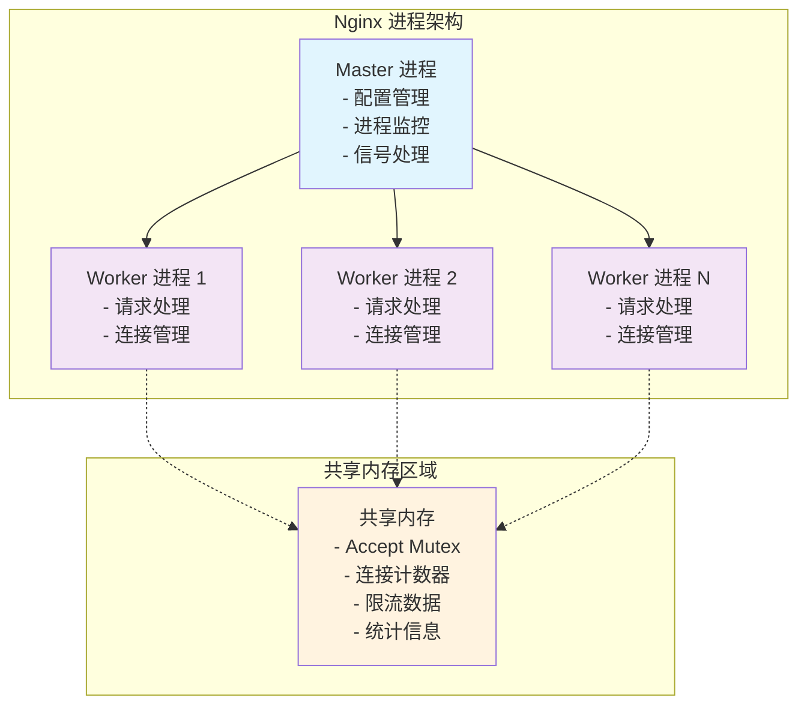

### 1.2 共享内存的核心需求

在nginx的运行过程中，共享内存主要满足以下几类需求：

**协调性需求**：多个worker进程需要协调对共享资源的访问，最典型的例子是accept mutex，它确保同一时刻只有一个worker进程监听新连接，避免"惊群效应"。

**状态同步需求**：某些功能模块需要在所有worker进程间同步状态信息，如upstream模块的服务器健康状态、限流模块的请求计数等。

**性能统计需求**：nginx需要收集全局的性能指标，如总连接数、请求处理速度、错误率等，这些数据需要跨进程汇总。

**缓存共享需求**：某些缓存数据（如SSL会话、DNS解析结果）在多个worker进程间共享可以显著提高性能。

### 1.3 共享内存基础数据结构

nginx共享内存的核心数据结构是`ngx_shm_t`，它抽象了不同操作系统平台上共享内存的基本属性和操作接口：

```c
// 共享内存基础结构体 - 抽象不同平台的共享内存实现
typedef struct {
    u_char      *addr;      // 共享内存映射到进程地址空间的起始地址
    size_t       size;      // 共享内存段的总大小（字节）
    ngx_str_t    name;      // 共享内存段的唯一标识名称
    ngx_log_t   *log;       // 用于记录共享内存操作日志的对象
    ngx_uint_t   exists;    // 标识共享内存段是否已经存在
#if (NGX_WIN32)
    HANDLE       handle;    // Windows平台特有的文件映射句柄
#endif
} ngx_shm_t;
```

这个结构体的设计体现了nginx跨平台兼容性的考虑。`addr`字段是最关键的，它指向共享内存在当前进程地址空间中的映射位置。由于不同进程的地址空间布局可能不同，同一块共享内存在不同进程中的虚拟地址可能不同，但物理内存是相同的。

## 2. 平台特定的共享内存实现机制

### 2.1 实现策略的选择原则

nginx在不同操作系统平台上采用了不同的共享内存实现策略，这种设计体现了nginx作为跨平台高性能服务器的深度技术考量。首先，nginx始终坚持性能优先的原则，针对每个平台的特性选择最优的实现方式，比如在现代Linux系统上优先使用高效的mmap匿名映射，而在较老的Unix系统上则回退到兼容性更好的System V IPC机制。其次，可靠性保障是nginx设计的核心要求，无论采用哪种底层实现，都必须确保共享内存的创建过程是健壮的，访问操作是安全的，即使在系统资源紧张或异常情况下也能正确处理。第三，资源管理方面，nginx精心设计了共享内存的生命周期管理机制，包括创建时的初始化、运行时的维护以及进程退出时的自动清理，避免内存泄漏和资源浪费。最后，兼容性考虑使得nginx能够在各种不同版本和配置的操作系统上稳定运行，从最新的Linux发行版到传统的Unix系统，从高端服务器到嵌入式设备，都能找到合适的共享内存实现方案。这种多层次的设计策略确保了nginx在保持高性能的同时，具备了广泛的平台适应性和长期的技术稳定性。

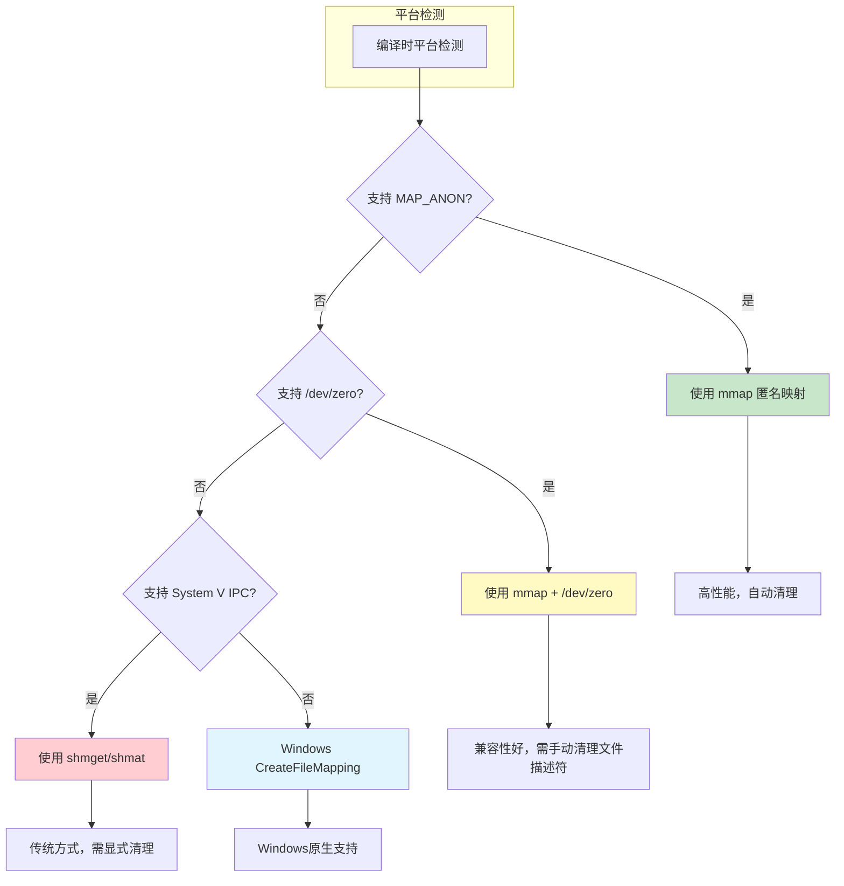

### 2.2 Unix/Linux平台 - mmap匿名映射实现

在现代Unix/Linux系统上，nginx优先使用mmap的匿名映射功能，这种选择体现了对性能和效率的极致追求。mmap匿名映射的最大优势在于其零拷贝特性，它能够直接将物理内存页映射到进程的虚拟地址空间中，从而彻底避免了传统共享内存机制中数据在内核空间和用户空间之间的拷贝操作，这种直接映射的方式显著减少了CPU开销和内存带宽消耗。同时，mmap还提供了优雅的自动清理机制，当所有引用该内存区域的进程都退出时，操作系统的内存管理子系统会自动检测并回收这些内存资源，这种自动化的资源管理避免了手动清理可能带来的复杂性和错误风险，确保了系统的稳定性。更重要的是，一旦内存映射建立完成，后续对这块共享内存的访问操作与普通内存访问在性能上完全相同，不会产生任何额外的系统调用开销，这使得nginx在高并发场景下能够以接近原生内存访问的速度来操作共享数据，从而实现了卓越的性能表现。

```c
// Unix平台mmap匿名映射实现 - 位置：src/os/unix/ngx_shmem.c
ngx_int_t ngx_shm_alloc(ngx_shm_t *shm)
{
    // 调用mmap系统调用创建匿名共享内存映射
    // NULL: 让内核选择映射地址
    // shm->size: 映射区域大小
    // PROT_READ|PROT_WRITE: 设置读写权限
    // MAP_ANON: 匿名映射，不关联文件
    // MAP_SHARED: 多进程共享映射
    shm->addr = (u_char *) mmap(NULL, shm->size,
                                PROT_READ|PROT_WRITE,
                                MAP_ANON|MAP_SHARED, -1, 0);

    if (shm->addr == MAP_FAILED) {
        ngx_log_error(NGX_LOG_ALERT, shm->log, ngx_errno,
                      "mmap(MAP_ANON|MAP_SHARED, %uz) failed", shm->size);
        return NGX_ERROR;
    }

    return NGX_OK;
}

// 释放mmap创建的共享内存
void ngx_shm_free(ngx_shm_t *shm)
{
    if (munmap((void *) shm->addr, shm->size) == -1) {
        ngx_log_error(NGX_LOG_ALERT, shm->log, ngx_errno,
                      "munmap(%p, %uz) failed", shm->addr, shm->size);
    }
}
```

这种实现的工作原理如下：

1. **内存分配**：内核在物理内存中分配连续的页面
2. **地址映射**：将物理页面映射到调用进程的虚拟地址空间
3. **继承机制**：fork创建的子进程自动继承父进程的内存映射
4. **共享访问**：所有映射了该内存区域的进程都可以直接访问

### 2.3 /dev/zero映射实现

在不支持MAP_ANON的较老Unix系统上，nginx采用了一种巧妙的替代方案——通过映射/dev/zero设备文件来实现共享内存。/dev/zero是Unix系统提供的一个特殊字符设备文件，它具有独特的特性：当进程从中读取数据时，总是返回无限的零字节流，而写入操作则会被简单地丢弃。nginx利用这一特性，通过mmap系统调用将/dev/zero映射到进程的虚拟地址空间中，从而创建出一块初始化为零的共享内存区域。

这种实现方式的工作流程相对简单但有效：首先打开/dev/zero设备文件获得文件描述符，然后使用mmap将该文件映射为共享内存，映射完成后立即关闭文件描述符（因为映射关系已经建立，不再需要文件描述符）。这种方法的优势在于兼容性极佳，几乎所有的Unix系统都支持/dev/zero设备，但缺点是需要额外的文件操作开销，包括打开和关闭设备文件的系统调用。

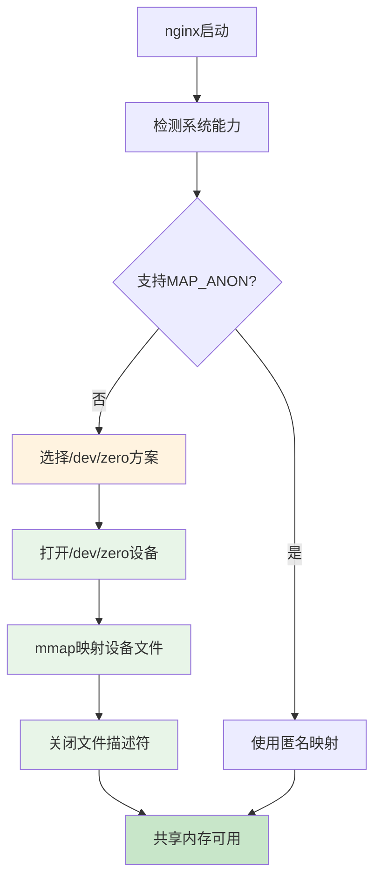

### 2.4 System V IPC实现

当系统既不支持MAP_ANON也无法使用/dev/zero时，nginx会回退到最传统但兼容性最好的System V IPC（Inter-Process Communication）机制。System V IPC是Unix系统早期就引入的进程间通信标准，它提供了一套完整的共享内存、信号量和消息队列机制。虽然这种方式在现代系统中已经不是首选，但它的广泛支持性使其成为最后的兜底方案。

System V共享内存的工作机制相对复杂，涉及三个关键的系统调用：shmget用于创建或获取共享内存段，它会在系统内核中分配一块共享内存并返回一个唯一的标识符；shmat用于将这个共享内存段附加到当前进程的地址空间中，使进程能够直接访问共享数据；shmctl则用于控制共享内存段的属性和生命周期。nginx在使用这种机制时采用了一个巧妙的策略：在创建共享内存后立即调用shmctl标记其为删除状态，这样当最后一个使用该内存段的进程退出时，系统会自动清理这块内存，避免了资源泄漏。

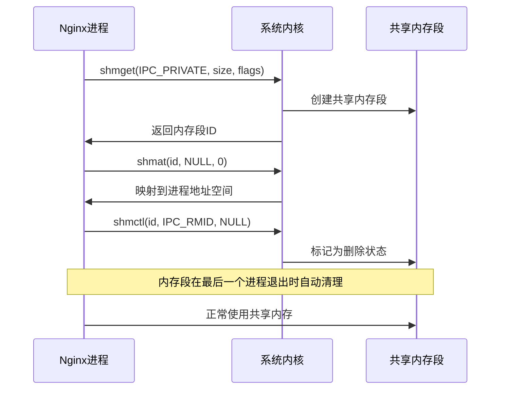

这种实现方式虽然步骤较多，但提供了最广泛的系统兼容性，确保nginx能够在各种古老的Unix系统上正常运行，体现了nginx对向后兼容性的重视。

### 2.5 Windows平台实现

Windows平台采用了与Unix系统完全不同的共享内存实现策略，基于Windows独有的文件映射对象（File Mapping Object）机制。这种设计体现了Windows操作系统面向对象的架构理念，将共享内存抽象为可命名、可继承、可安全控制的内核对象。与Unix系统的直接内存映射不同，Windows的文件映射对象提供了更丰富的功能特性和更精细的访问控制机制。

Windows共享内存的实现过程体现了其独特的设计哲学：首先通过CreateFileMapping API创建一个命名的文件映射对象，这个对象可以基于物理文件，也可以基于系统页面文件（虚拟内存）。nginx选择了后者，即不关联任何物理文件，而是使用系统的页面文件作为存储后端，这样既避免了磁盘I/O开销，又能充分利用Windows的虚拟内存管理机制。创建文件映射对象时需要指定大小参数，由于Windows API的历史原因，大小需要分为高32位和低32位两个参数传递，以支持超过4GB的大内存映射。

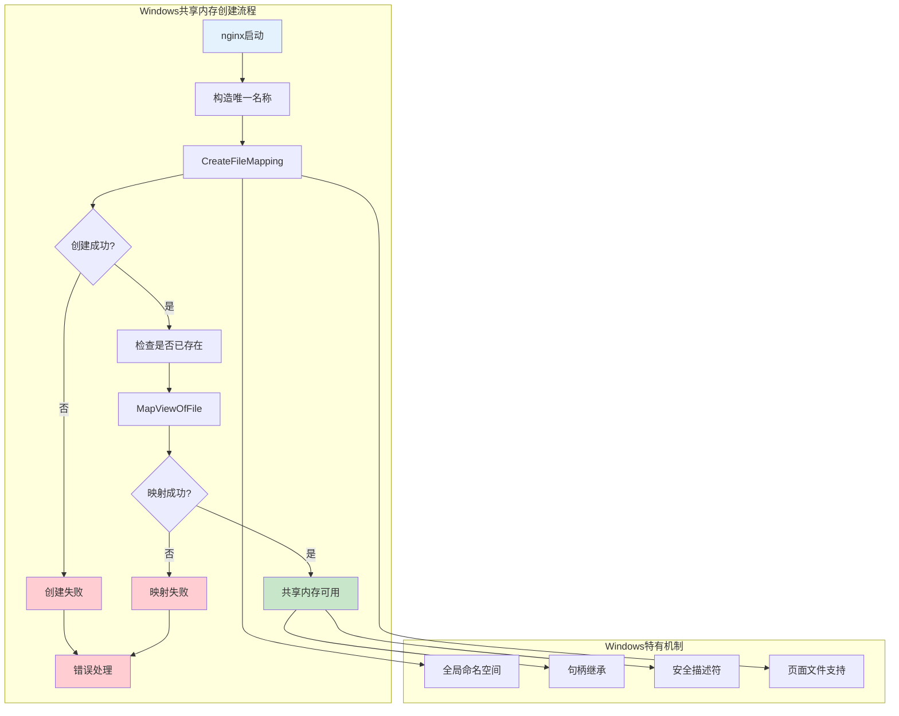

Windows实现的核心优势在于其强大的命名机制和安全控制能力。通过全局命名的文件映射对象，不同进程可以通过相同的名称访问同一块共享内存，这种命名机制比Unix系统的地址映射更加灵活和可控。同时，Windows的句柄继承机制使得子进程能够自动获得对父进程创建的共享内存的访问权限，简化了进程间的权限传递。此外，Windows的安全描述符机制为共享内存提供了细粒度的访问控制，可以精确控制哪些用户和进程能够访问特定的共享内存区域，这在企业级应用中具有重要的安全价值。最后，基于页面文件的存储方式使得共享内存能够充分利用Windows的虚拟内存管理优势，包括内存压缩、页面交换等高级特性，在内存紧张时仍能保持系统的稳定运行。


## 3. 共享内存区域管理架构

### 3.1 分层管理的设计理念

nginx的共享内存管理采用了分层架构设计，将底层的平台特定实现与上层的业务逻辑分离。这种设计的核心思想是：

**抽象层**：`ngx_shm_t`提供统一的底层共享内存接口，屏蔽平台差异

**管理层**：`ngx_shm_zone_t`提供高级的共享内存区域管理功能

**应用层**：各个模块通过标准接口使用共享内存服务

[//]: # (这种分层设计为nginx带来了显著的架构优势和技术价值。首先，平台无关性是这种设计的核心价值，通过统一的抽象接口，上层的业务逻辑代码完全无需关心底层是使用mmap、System V IPC还是Windows文件映射，这种抽象不仅简化了代码维护，更重要的是确保了nginx在不同操作系统上的行为一致性。其次，模块化管理机制使得每个共享内存区域都能够作为独立的实体进行管理和初始化，不同模块可以根据自己的需求创建专属的共享内存区域，而不会相互干扰，这种隔离性大大提高了系统的稳定性和可维护性。第三，完善的生命周期控制机制支持了从创建到销毁的完整流程管理，包括初始化时的数据结构建立、运行时的重用检测、配置重载时的状态迁移以及进程退出时的资源清理，这种精细化的控制确保了共享内存资源的高效利用和安全回收。最后，智能的冲突检测机制能够自动识别和处理共享内存区域的命名冲突，当不同模块尝试创建同名区域时，系统会进行严格的兼容性检查，包括大小匹配、标签验证等，从而避免了配置错误可能导致的系统异常，保障了nginx的稳定运行。)

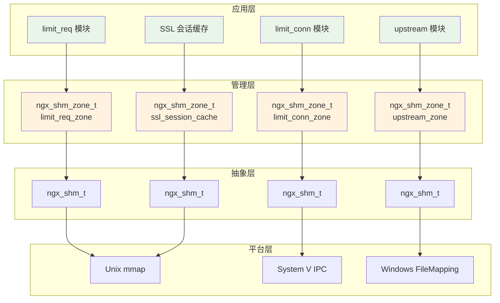

### 3.2 nginx共享内存运行原理与核心算法

nginx共享内存系统的运行原理建立在现代操作系统虚拟内存管理和进程间通信理论基础之上，采用了多种经典算法和创新设计来实现高效、安全的内存共享机制。整个系统的核心运行原理可以概括为"分层映射、统一管理、智能分配"的架构模式。

#### 3.2.1 虚拟内存映射算法

nginx共享内存的底层运行基于虚拟内存映射算法，这是现代操作系统内存管理的核心技术。该算法的工作原理是通过内存管理单元（MMU）建立虚拟地址到物理地址的映射关系，使得不同进程能够通过各自的虚拟地址空间访问相同的物理内存页面。nginx巧妙地利用了这一机制，在master进程中创建共享内存映射后，通过fork系统调用的继承特性，使得所有worker进程都能自动获得对相同物理内存的访问能力。

这种映射算法的核心优势在于地址转换的硬件加速特性。现代CPU的MMU能够在硬件层面快速完成虚拟地址到物理地址的转换，转换过程通常只需要几个CPU周期，这使得共享内存的访问性能接近于普通内存访问。同时，操作系统的页表缓存（TLB）机制进一步优化了地址转换的效率，频繁访问的内存页面的地址转换信息会被缓存在TLB中，避免了重复的页表查找开销。

#### 3.2.2 Slab内存分配算法

在共享内存映射的基础上，nginx实现了基于Slab算法的内存分配器，这是一种专门为内核级内存管理设计的高效分配算法。Slab算法的核心思想是将内存按照对象大小进行分类管理，为每种大小的对象维护专门的内存池，从而减少内存碎片并提高分配效率。

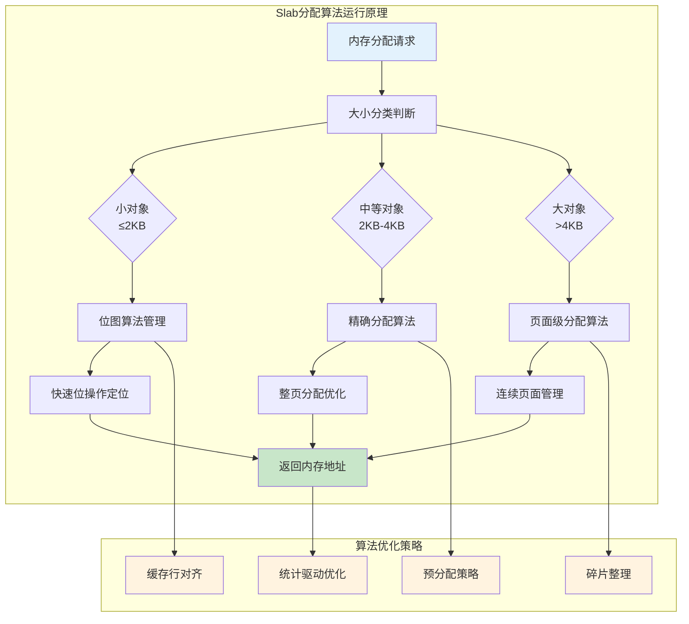

Slab算法在nginx中的具体实现采用了三级分配策略：对于小对象（通常小于2KB），使用位图算法进行快速分配，每个位代表一个固定大小的内存块，通过位操作可以快速定位空闲块；对于中等大小的对象，采用精确分配策略，为每个页面维护分配状态信息；对于大对象，则直接进行页面级分配，支持跨页面的连续内存分配。

#### 3.2.3 原子操作与无锁算法

nginx共享内存系统大量使用了原子操作和无锁算法来实现高并发环境下的数据一致性。原子操作是现代CPU提供的硬件级同步原语，能够保证特定操作的原子性，即操作要么完全执行，要么完全不执行，不会出现中间状态。nginx利用原子操作实现了多种无锁数据结构，如原子计数器、无锁队列等。

最典型的应用是Accept Mutex的实现，它使用了基于原子比较交换（CAS）操作的自旋锁算法。该算法的工作原理是：进程首先读取锁的当前值，然后尝试使用CAS操作将锁值从0改为自己的进程ID，如果操作成功则获得锁，否则进入自旋等待状态。这种算法的优势在于避免了系统调用的开销，在锁竞争不激烈的情况下能够提供极高的性能。

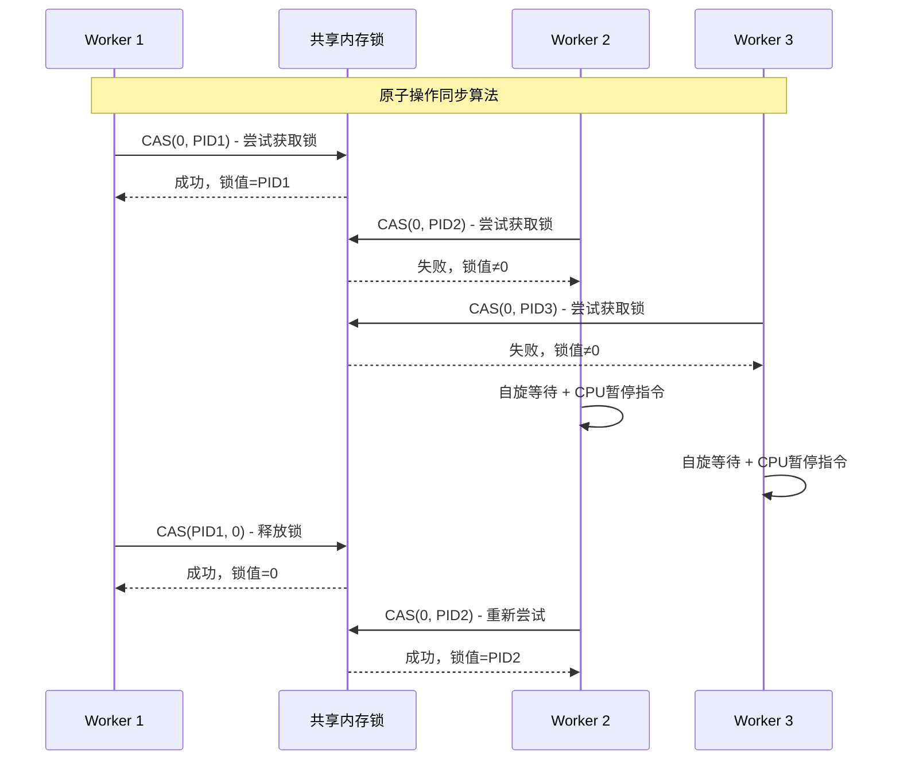

#### 3.2.4 红黑树与哈希表算法

在共享内存之上，nginx的各个模块实现了多种高效的数据结构算法。最常用的是红黑树算法，它是一种自平衡的二叉搜索树，能够保证在最坏情况下仍具有O(log n)的查找、插入和删除时间复杂度。limit_req和limit_conn模块都使用红黑树来存储客户端记录，通过客户端标识（如IP地址）作为键值进行快速查找。

红黑树算法的核心优势在于其平衡性保证，通过颜色标记和旋转操作，确保树的高度始终保持在较低水平。在nginx的实现中，红黑树还结合了LRU（最近最少使用）算法，通过维护一个双向链表来跟踪节点的访问顺序，当内存不足时可以快速淘汰最久未使用的记录。

#### 3.2.5 内存池与对象池算法

nginx共享内存系统还实现了内存池和对象池算法来优化内存分配性能。内存池算法的核心思想是预先分配大块内存，然后在其中进行小块分配，避免频繁的系统调用开销。对象池算法则是针对特定类型的对象进行优化，预先创建一定数量的对象实例，使用时直接从池中获取，用完后归还到池中，避免了对象创建和销毁的开销。

这些算法的组合使用使得nginx共享内存系统在高并发环境下仍能保持优异的性能表现，同时确保了数据的一致性和系统的稳定性。

### 3.3 内存映射与地址空间管理原理

nginx共享内存的地址空间管理体现了现代操作系统虚拟内存机制的精妙运用。在多进程环境中，每个进程都拥有独立的虚拟地址空间，但共享内存的核心价值在于让不同进程能够访问相同的物理内存页面。这种映射关系的建立依赖于操作系统的内存管理单元（MMU），它负责将虚拟地址转换为物理地址。nginx的设计巧妙地利用了这一机制，通过在不同进程中建立到相同物理内存的映射，实现了真正的数据共享。

地址空间管理的复杂性在于不同进程中的虚拟地址可能不同，但指向的物理内存是相同的。这种设计的深层原理在于分离了逻辑地址和物理地址的概念，使得共享内存的使用者无需关心具体的物理内存位置，只需要通过虚拟地址进行访问。nginx通过统一的地址管理接口，屏蔽了这种复杂性，确保了跨进程访问的一致性和可靠性。同时，这种设计还支持了内存保护机制，操作系统可以为不同的内存区域设置不同的访问权限，提高了系统的安全性。

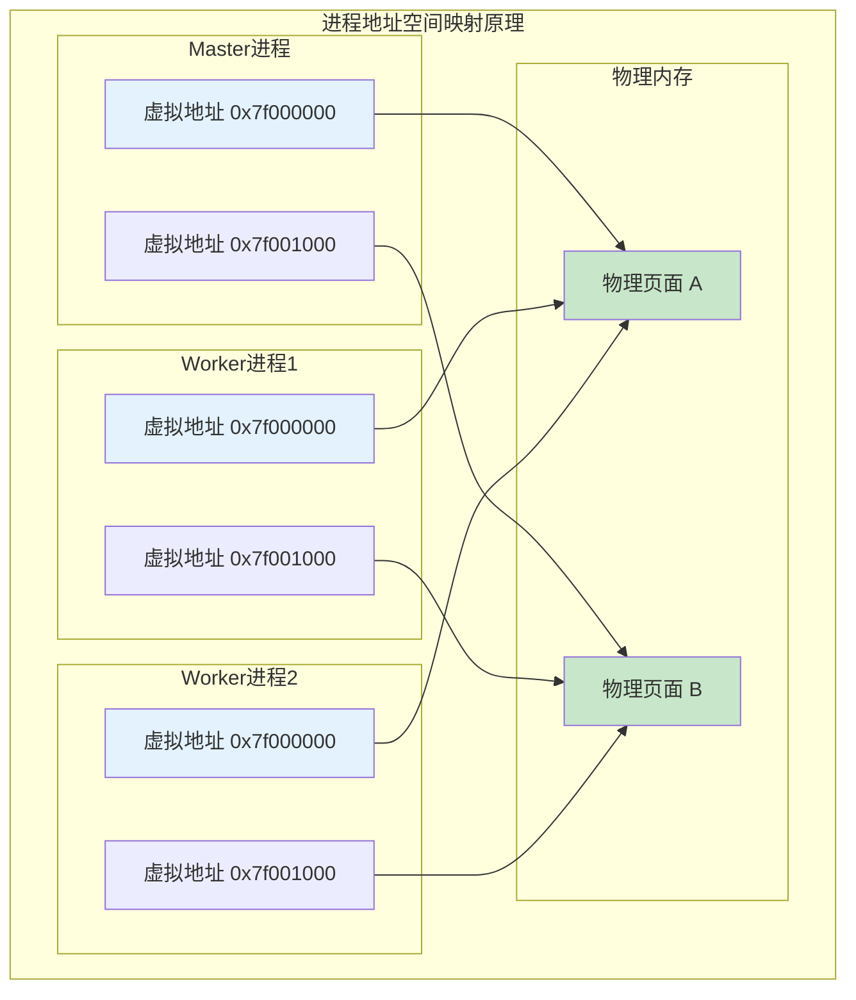

### 3.4 生命周期管理与继承机制原理

nginx共享内存的生命周期管理是一个复杂的系统工程，涉及操作系统内核机制、进程管理算法、内存回收策略等多个层面的协同工作。整个生命周期可以分为创建、继承、使用、维护和销毁五个关键阶段，每个阶段都采用了特定的算法和机制来确保系统的稳定性和资源的高效利用。

#### 3.4.1 进程继承机制与写时复制算法

nginx共享内存继承机制的核心基于Unix系统的fork()系统调用和写时复制（Copy-on-Write, COW）算法。当master进程调用fork()创建worker进程时，操作系统内核会复制父进程的页表结构，但不会立即复制实际的物理内存页面。相反，父子进程会共享相同的物理内存页面，只有当某个进程尝试修改内存内容时，才会触发页面复制操作。

然而，对于共享内存而言，这种机制有着特殊的处理逻辑。由于共享内存页面在创建时就被标记为共享属性（通过MAP_SHARED标志），操作系统内核会将这些页面排除在写时复制机制之外。这意味着即使子进程修改共享内存的内容，也不会触发页面复制，而是直接修改原始的物理内存页面，从而实现了真正的内存共享。

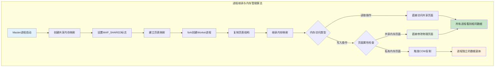

#### 3.4.2 引用计数与自动回收算法

nginx实现了一套精密的引用计数算法来管理共享内存的生命周期。每个共享内存区域都维护着一个引用计数器，记录当前有多少个进程正在使用该内存区域。这个计数器的管理采用了原子操作来确保在多进程环境下的一致性。

引用计数算法的工作流程如下：当master进程创建共享内存时，引用计数初始化为1；每当fork()创建新的worker进程时，引用计数原子性地增加1；当进程正常退出或异常终止时，操作系统会自动清理该进程的内存映射，引用计数相应地减少1；当引用计数降为0时，表示没有任何进程在使用该共享内存，系统会触发自动回收机制。

不同平台的引用计数实现有所差异：在Linux系统上，mmap匿名映射的引用计数由内核自动维护；在System V IPC系统上，nginx通过IPC_RMID标志实现延迟删除，当最后一个进程调用shmdt()时自动清理；在Windows系统上，文件映射对象使用内核对象的引用计数机制，当所有句柄都关闭时自动销毁对象。

#### 3.4.3 配置重载与内存迁移算法

nginx的配置重载机制涉及复杂的内存迁移算法，需要在保持服务连续性的同时完成共享内存的更新。这个过程采用了"新旧并存、平滑切换"的策略，具体算法流程如下：

首先，nginx会创建新的配置周期（cycle），在新周期中重新解析配置文件并创建新的共享内存区域。对于可重用的共享内存区域（noreuse标志为0），系统会检查新旧配置的兼容性，如果名称、大小和标签都匹配，则直接复用现有的内存区域；对于不可重用的区域，则创建全新的内存映射。

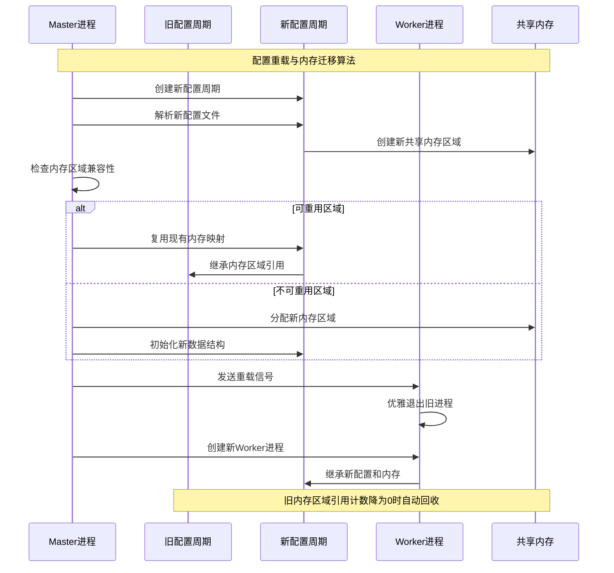

#### 3.4.4 异常处理与资源清理算法

nginx实现了完善的异常处理和资源清理算法，确保在各种异常情况下都能正确回收共享内存资源。这套算法包括信号处理、进程监控、资源泄漏检测等多个组件。

信号处理算法负责捕获进程终止信号（如SIGTERM、SIGKILL等），在进程退出前执行必要的清理操作。对于正常的进程退出，nginx会调用注册的清理函数，更新共享内存中的状态信息，如连接计数、统计数据等。对于异常终止的情况，操作系统内核会自动清理进程的内存映射，共享内存的引用计数会相应减少。

进程监控算法运行在master进程中，定期检查worker进程的状态。当检测到worker进程异常退出时，master会分析退出原因，并决定是否需要重启进程。同时，master还会检查共享内存的一致性，确保异常退出的进程没有留下不一致的数据状态。

#### 3.4.5 内存碎片整理与优化算法

长期运行的nginx实例可能会面临共享内存碎片化的问题，特别是在频繁分配和释放小对象的场景下。nginx实现了多种内存碎片整理和优化算法来解决这个问题。

Slab分配器采用了伙伴算法（Buddy Algorithm）的变种来管理内存页面，当相邻的空闲页面可以合并时，系统会自动进行合并操作，形成更大的连续空闲区域。对于小对象的分配，nginx使用了最佳适配算法（Best Fit），在满足大小要求的空闲块中选择最小的一个，以减少内存浪费。

此外，nginx还实现了基于时间的垃圾回收算法，定期扫描共享内存中的过期数据（如过期的限流记录、SSL会话等），及时释放不再需要的内存空间。这种主动的内存管理策略有效地减少了内存碎片的产生，提高了内存利用率。

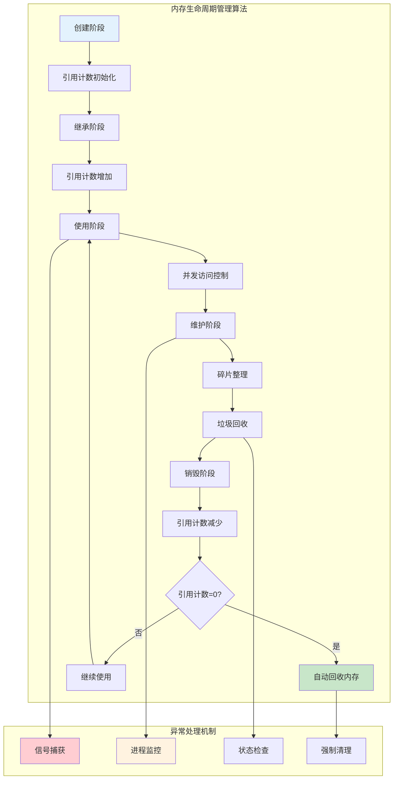

这套完整的生命周期管理机制确保了nginx共享内存系统在各种运行环境和异常情况下都能保持稳定可靠的运行状态，为nginx的高可用性提供了坚实的基础保障。

---

## 4. 总结

nginx共享内存系统的设计和实现体现了现代系统软件工程的最佳实践，其技术价值不仅在于解决了特定的技术问题，更在于展现了系统性的工程思维和架构智慧:

**虚拟内存映射原理**：nginx通过操作系统MMU硬件单元建立虚拟地址到物理地址的映射关系，利用TLB缓存机制加速地址转换过程，并巧妙运用fork系统调用的内存映射继承特性，使得多个worker进程能够通过各自独立的虚拟地址空间访问相同的物理内存页面，从而在硬件层面实现了零拷贝的高效内存共享。

**Slab分配器原理**：nginx实现了基于对象大小分类的三级内存分配策略，小对象通过位图算法进行快速定位和分配，中等对象采用精确分配机制，大对象直接进行页面级管理。通过预分配内存池、缓存行对齐优化和分级管理策略，有效减少了内存碎片产生，提高了分配效率和内存利用率。

**无锁同步原理**：nginx大量采用CPU硬件提供的原子指令，特别是比较交换（CAS）操作来实现无锁数据结构。Accept Mutex通过原子操作结合自旋等待和指数退避策略，避免了传统互斥锁的系统调用开销，在高并发环境下实现了高效的进程间同步和数据一致性保障。

**生命周期管理原理**：nginx建立了基于引用计数的自动内存回收机制，结合操作系统的写时复制算法确保进程间内存映射的正确继承。通过配置重载时的内存迁移策略、异常情况下的强制清理机制，以及基于伙伴算法的内存碎片整理和时间驱动的垃圾回收机制，构建了完整的内存生命周期自动化管理体系。


