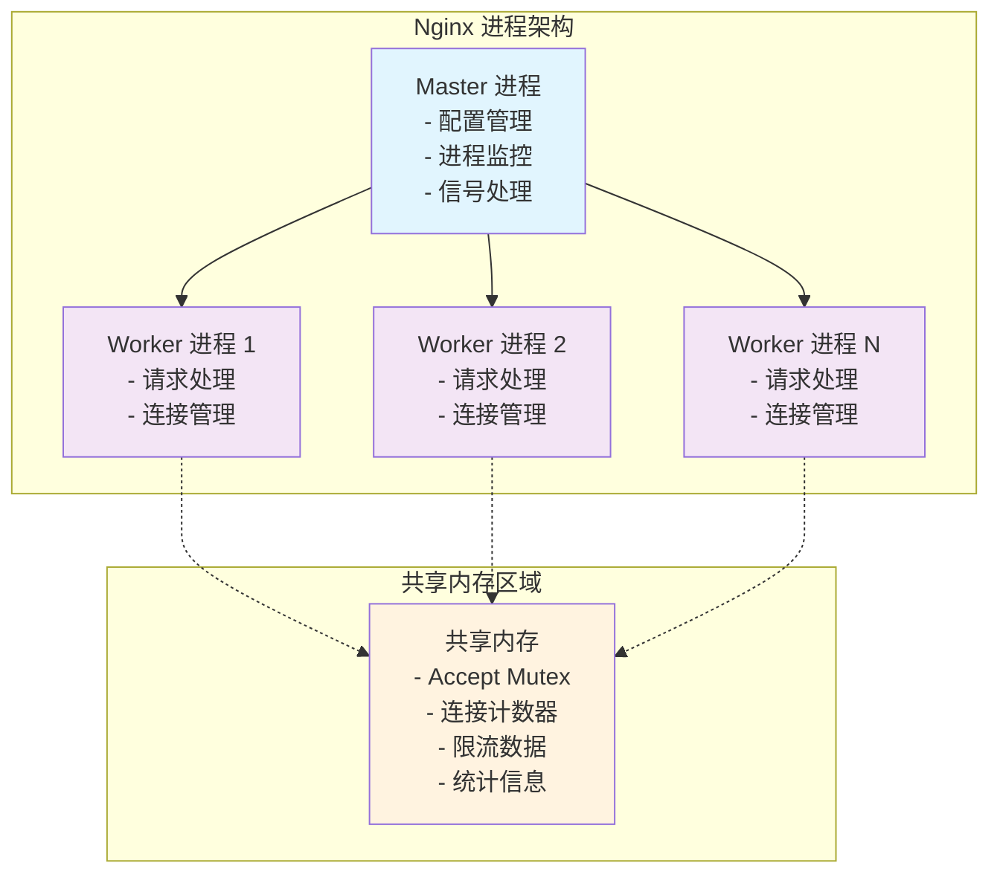
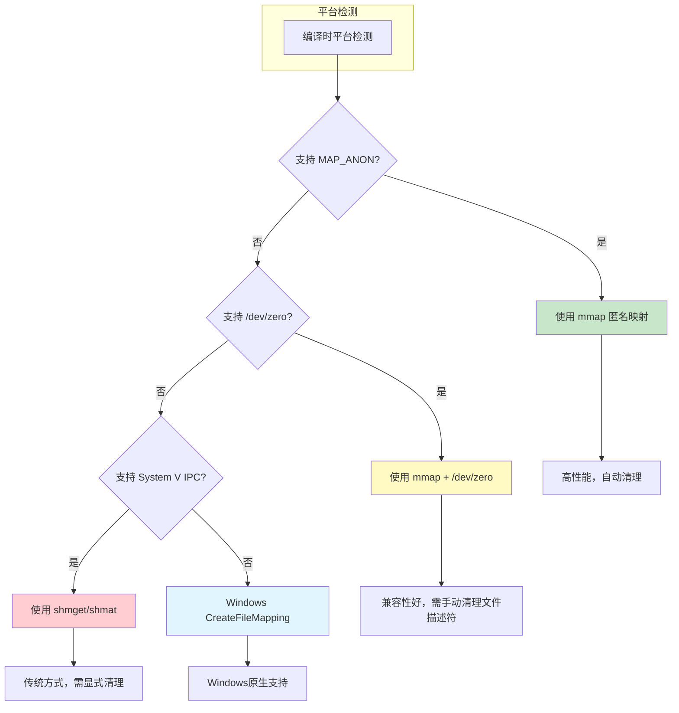
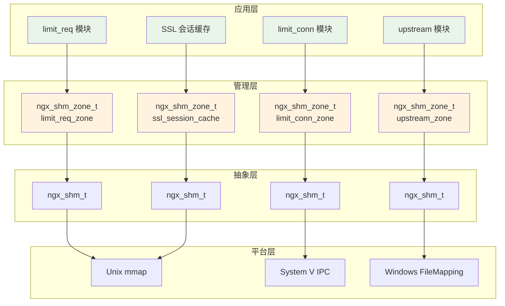
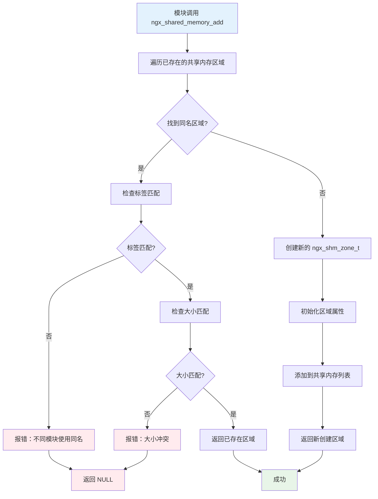

# Nginx Master-Worker 进程间共享内存实现深度解析

## 概述

在现代高性能web服务器的设计中，进程间通信（IPC）是一个至关重要的技术挑战。nginx采用了master-worker多进程架构，其中master进程承担管理职责，而多个worker进程负责处理实际的客户端请求。这种架构设计带来了显著的性能优势和稳定性保障，但同时也引入了进程间数据共享和协调的复杂性。

nginx通过精心设计的共享内存机制解决了这一挑战。共享内存不仅实现了进程间的高效数据交换，还支持了诸如连接限制、请求频率控制、负载均衡状态同步等关键功能。本文将从底层实现原理出发，深入剖析nginx共享内存的架构设计、同步机制、内存管理策略以及在实际场景中的应用。

## 1. nginx进程架构与共享内存需求分析

### 1.1 多进程架构的设计理念

nginx的多进程架构遵循了"一个master，多个worker"的经典模式。这种设计的核心优势在于：

1. **故障隔离**：单个worker进程的崩溃不会影响整个服务
2. **资源利用**：充分利用多核CPU的并行处理能力
3. **热重载**：支持无缝的配置更新和代码升级
4. **权限分离**：master进程以root权限运行，worker进程以普通用户权限运行

然而，这种架构也带来了数据共享的挑战。多个worker进程需要协调访问共同的资源，如监听套接字、连接计数器、限流状态等。传统的进程间通信方式（如管道、消息队列）在高并发场景下性能不足，因此nginx选择了共享内存作为主要的IPC机制。



### 1.2 共享内存的核心需求

在nginx的运行过程中，共享内存主要满足以下几类需求：

**协调性需求**：多个worker进程需要协调对共享资源的访问，最典型的例子是accept mutex，它确保同一时刻只有一个worker进程监听新连接，避免"惊群效应"。

**状态同步需求**：某些功能模块需要在所有worker进程间同步状态信息，如upstream模块的服务器健康状态、限流模块的请求计数等。

**性能统计需求**：nginx需要收集全局的性能指标，如总连接数、请求处理速度、错误率等，这些数据需要跨进程汇总。

**缓存共享需求**：某些缓存数据（如SSL会话、DNS解析结果）在多个worker进程间共享可以显著提高性能。

### 1.3 共享内存基础数据结构

nginx共享内存的核心数据结构是`ngx_shm_t`，它抽象了不同操作系统平台上共享内存的基本属性和操作接口：

```c
// 共享内存基础结构体 - 抽象不同平台的共享内存实现
typedef struct {
    u_char      *addr;      // 共享内存映射到进程地址空间的起始地址
    size_t       size;      // 共享内存段的总大小（字节）
    ngx_str_t    name;      // 共享内存段的唯一标识名称
    ngx_log_t   *log;       // 用于记录共享内存操作日志的对象
    ngx_uint_t   exists;    // 标识共享内存段是否已经存在
#if (NGX_WIN32)
    HANDLE       handle;    // Windows平台特有的文件映射句柄
#endif
} ngx_shm_t;
```

这个结构体的设计体现了nginx跨平台兼容性的考虑。`addr`字段是最关键的，它指向共享内存在当前进程地址空间中的映射位置。由于不同进程的地址空间布局可能不同，同一块共享内存在不同进程中的虚拟地址可能不同，但物理内存是相同的。

## 2. 平台特定的共享内存实现机制

### 2.1 实现策略的选择原则

nginx在不同操作系统平台上采用了不同的共享内存实现策略，这种设计遵循了以下原则：

1. **性能优先**：选择每个平台上性能最优的实现方式
2. **可靠性保障**：确保共享内存的创建和访问是可靠的
3. **资源管理**：合理处理共享内存的生命周期和清理
4. **兼容性考虑**：支持不同版本和配置的操作系统



### 2.2 Unix/Linux平台 - mmap匿名映射实现

在现代Unix/Linux系统上，nginx优先使用mmap的匿名映射功能。这种实现方式具有以下优势：

**零拷贝特性**：mmap直接将物理内存页映射到进程地址空间，避免了数据在内核空间和用户空间之间的拷贝。

**自动清理**：当所有引用该内存区域的进程都退出时，操作系统会自动回收内存，无需显式清理。

**高效访问**：映射后的内存访问与普通内存访问性能相同，没有额外的系统调用开销。

```c
// Unix平台mmap匿名映射实现 - 位置：src/os/unix/ngx_shmem.c
ngx_int_t ngx_shm_alloc(ngx_shm_t *shm)
{
    // 调用mmap系统调用创建匿名共享内存映射
    // NULL: 让内核选择映射地址
    // shm->size: 映射区域大小
    // PROT_READ|PROT_WRITE: 设置读写权限
    // MAP_ANON: 匿名映射，不关联文件
    // MAP_SHARED: 多进程共享映射
    shm->addr = (u_char *) mmap(NULL, shm->size,
                                PROT_READ|PROT_WRITE,
                                MAP_ANON|MAP_SHARED, -1, 0);

    if (shm->addr == MAP_FAILED) {
        ngx_log_error(NGX_LOG_ALERT, shm->log, ngx_errno,
                      "mmap(MAP_ANON|MAP_SHARED, %uz) failed", shm->size);
        return NGX_ERROR;
    }

    return NGX_OK;
}

// 释放mmap创建的共享内存
void ngx_shm_free(ngx_shm_t *shm)
{
    if (munmap((void *) shm->addr, shm->size) == -1) {
        ngx_log_error(NGX_LOG_ALERT, shm->log, ngx_errno,
                      "munmap(%p, %uz) failed", shm->addr, shm->size);
    }
}
```

这种实现的工作原理如下：

1. **内存分配**：内核在物理内存中分配连续的页面
2. **地址映射**：将物理页面映射到调用进程的虚拟地址空间
3. **继承机制**：fork创建的子进程自动继承父进程的内存映射
4. **共享访问**：所有映射了该内存区域的进程都可以直接访问

### 2.3 /dev/zero映射实现

在不支持MAP_ANON的较老Unix系统上，nginx使用/dev/zero设备文件实现共享内存：


```c
// /dev/zero映射实现 - 位置：src/os/unix/ngx_shmem.c
ngx_int_t ngx_shm_alloc(ngx_shm_t *shm)
{
    ngx_fd_t fd;

    // 打开/dev/zero设备文件
    fd = open("/dev/zero", O_RDWR);
    if (fd == -1) {
        ngx_log_error(NGX_LOG_ALERT, shm->log, ngx_errno,
                      "open(\"/dev/zero\") failed");
        return NGX_ERROR;
    }

    // 使用/dev/zero作为映射源创建共享内存
    shm->addr = (u_char *) mmap(NULL, shm->size,
                                PROT_READ|PROT_WRITE,
                                MAP_SHARED, fd, 0);

    if (shm->addr == MAP_FAILED) {
        ngx_log_error(NGX_LOG_ALERT, shm->log, ngx_errno,
                      "mmap(/dev/zero, MAP_SHARED, %uz) failed", shm->size);
    }

    // 关闭文件描述符（映射已建立，不再需要）
    if (close(fd) == -1) {
        ngx_log_error(NGX_LOG_ALERT, shm->log, ngx_errno,
                      "close(\"/dev/zero\") failed");
    }

    return (shm->addr == MAP_FAILED) ? NGX_ERROR : NGX_OK;
}
```

/dev/zero是Unix系统提供的特殊设备文件，读取时返回无限的零字节流。通过mmap映射/dev/zero，可以创建初始化为零的共享内存区域。这种方式的特点是兼容性好，但需要额外的文件描述符操作。

### 2.4 System V IPC实现

在最传统的Unix系统上，nginx回退到使用System V IPC机制。这是最古老但兼容性最好的共享内存实现方式：

```c
// System V IPC实现 - 位置：src/os/unix/ngx_shmem.c
ngx_int_t ngx_shm_alloc(ngx_shm_t *shm)
{
    int id;

    // 使用shmget创建共享内存段
    // IPC_PRIVATE: 创建私有共享内存段
    // shm->size: 共享内存大小
    // SHM_R|SHM_W|IPC_CREAT: 读写权限和创建标志
    id = shmget(IPC_PRIVATE, shm->size, (SHM_R|SHM_W|IPC_CREAT));
    if (id == -1) {
        ngx_log_error(NGX_LOG_ALERT, shm->log, ngx_errno,
                      "shmget(%uz) failed", shm->size);
        return NGX_ERROR;
    }

    // 将共享内存段附加到当前进程的地址空间
    shm->addr = shmat(id, NULL, 0);
    if (shm->addr == (void *) -1) {
        ngx_log_error(NGX_LOG_ALERT, shm->log, ngx_errno,
                      "shmat() failed");
    }

    // 立即标记共享内存段为删除状态
    // 这样当最后一个进程分离时，内存段会被自动清理
    if (shmctl(id, IPC_RMID, NULL) == -1) {
        ngx_log_error(NGX_LOG_ALERT, shm->log, ngx_errno,
                      "shmctl(IPC_RMID) failed");
    }

    return (shm->addr == (void *) -1) ? NGX_ERROR : NGX_OK;
}
```

System V IPC的工作机制相对复杂：

1. **创建阶段**：shmget在系统中创建一个共享内存段，返回标识符
2. **附加阶段**：shmat将共享内存段映射到进程地址空间
3. **清理机制**：通过IPC_RMID标记删除，实现自动清理

### 2.5 Windows平台实现

Windows平台使用文件映射对象（File Mapping Object）实现共享内存，这是Windows系统提供的标准共享内存机制：

```c
// Windows平台实现 - 位置：src/os/win32/ngx_shmem.c
ngx_int_t ngx_shm_alloc(ngx_shm_t *shm)
{
    u_char   *name;
    uint64_t  size;

    // 构造唯一的共享内存名称
    name = ngx_alloc(shm->name.len + 2 + NGX_INT32_LEN, shm->log);
    if (name == NULL) {
        return NGX_ERROR;
    }

    (void) ngx_sprintf(name, "%V_%s%Z", &shm->name, ngx_unique);

    size = shm->size;

    // 创建文件映射对象
    // INVALID_HANDLE_VALUE: 不关联物理文件，使用系统页面文件
    // PAGE_READWRITE: 读写权限
    // 大小参数分为高32位和低32位传递
    shm->handle = CreateFileMapping(INVALID_HANDLE_VALUE, NULL,
                                    PAGE_READWRITE,
                                    (u_long) (size >> 32),
                                    (u_long) (size & 0xffffffff),
                                    (char *) name);

    if (shm->handle == NULL) {
        ngx_log_error(NGX_LOG_ALERT, shm->log, ngx_errno,
                      "CreateFileMapping(%uz, %s) failed",
                      shm->size, name);
        ngx_free(name);
        return NGX_ERROR;
    }

    ngx_free(name);

    // 检查是否是已存在的共享内存
    if (ngx_errno == ERROR_ALREADY_EXISTS) {
        shm->exists = 1;
    }

    // 将文件映射对象映射到当前进程的地址空间
    shm->addr = MapViewOfFile(shm->handle, FILE_MAP_WRITE, 0, 0, 0);

    if (shm->addr == NULL) {
        ngx_log_error(NGX_LOG_ALERT, shm->log, ngx_errno,
                      "MapViewOfFile(%uz) failed", shm->size);
        return NGX_ERROR;
    }

    return NGX_OK;
}
```

Windows实现的特点：

1. **命名机制**：使用全局命名的文件映射对象，支持跨进程访问
2. **页面文件支持**：不关联物理文件，使用系统页面文件作为存储
3. **继承性**：子进程可以通过句柄继承访问共享内存
4. **安全性**：支持Windows的安全描述符机制


## 3. 共享内存区域管理架构

### 3.1 分层管理的设计理念

nginx的共享内存管理采用了分层架构设计，将底层的平台特定实现与上层的业务逻辑分离。这种设计的核心思想是：

**抽象层**：`ngx_shm_t`提供统一的底层共享内存接口，屏蔽平台差异
**管理层**：`ngx_shm_zone_t`提供高级的共享内存区域管理功能
**应用层**：各个模块通过标准接口使用共享内存服务

这种分层设计带来了以下优势：

1. **平台无关性**：上层代码无需关心底层实现细节
2. **模块化管理**：每个共享内存区域可以独立管理和初始化
3. **生命周期控制**：支持复杂的创建、初始化、重用和销毁流程
4. **冲突检测**：自动检测和处理共享内存区域的命名冲突



### 3.2 共享内存区域结构详解

`ngx_shm_zone_t`是nginx共享内存管理的核心数据结构，它封装了共享内存区域的完整生命周期管理：

```c
// 共享内存区域管理结构体 - 位置：src/core/ngx_cycle.h
struct ngx_shm_zone_s {
    void                     *data;      // 指向模块特定的数据结构
    ngx_shm_t                 shm;       // 底层共享内存对象
    ngx_shm_zone_init_pt      init;      // 区域初始化回调函数
    void                     *tag;       // 模块标识标签，用于区分不同模块
    void                     *sync;      // 同步对象（预留字段）
    ngx_uint_t                noreuse;   // 禁止重用标志
};
```

各字段的详细说明：

**data字段**：指向模块特定的数据结构。不同模块会在这里存储自己的控制信息，如limit_req模块的红黑树根节点、upstream模块的服务器列表等。

**shm字段**：嵌入的底层共享内存对象，包含实际的内存地址、大小等信息。

**init字段**：指向模块提供的初始化回调函数。nginx在创建共享内存后会调用此函数进行模块特定的初始化。

**tag字段**：模块标识标签，通常指向模块的全局变量地址。用于区分不同模块创建的同名共享内存区域。

**noreuse字段**：控制共享内存区域是否可以在配置重载时重用。某些模块（如upstream）需要在重载时重新初始化，会设置此标志。

### 3.3 共享内存区域创建流程

共享内存区域的创建是一个复杂的过程，涉及冲突检测、大小验证、生命周期管理等多个环节。`ngx_shared_memory_add`函数实现了这一核心逻辑：

```c
// 创建或获取共享内存区域 - 位置：src/core/ngx_cycle.c
ngx_shm_zone_t *ngx_shared_memory_add(ngx_conf_t *cf, ngx_str_t *name,
                                       size_t size, void *tag)
{
    ngx_uint_t        i;
    ngx_shm_zone_t   *shm_zone;
    ngx_list_part_t  *part;

    // 从当前配置周期中获取共享内存区域列表
    part = &cf->cycle->shared_memory.part;
    shm_zone = part->elts;

    // 遍历已存在的共享内存区域，检查是否有同名区域
    for (i = 0; /* void */; i++) {

        if (i >= part->nelts) {
            if (part->next == NULL) {
                break;
            }
            part = part->next;
            shm_zone = part->elts;
            i = 0;
        }

        // 检查名称是否匹配
        if (shm_zone[i].shm.name.len != name->len) {
            continue;
        }

        if (ngx_strncmp(shm_zone[i].shm.name.data, name->data, name->len) != 0) {
            continue;
        }

        // 找到同名区域，进行兼容性检查

        // 检查标签是否匹配（确保是同一个模块）
        if (tag != shm_zone[i].tag) {
            ngx_conf_log_error(NGX_LOG_EMERG, cf, 0,
                            "the shared memory zone \"%V\" is "
                            "already declared for a different use",
                            &shm_zone[i].shm.name);
            return NULL;
        }

        // 检查大小是否兼容
        if (size && size != shm_zone[i].shm.size) {
            ngx_conf_log_error(NGX_LOG_EMERG, cf, 0,
                            "the size %uz of shared memory zone \"%V\" "
                            "conflicts with already declared size %uz",
                            size, &shm_zone[i].shm.name,
                            shm_zone[i].shm.size);
            return NULL;
        }

        // 返回已存在的区域
        return &shm_zone[i];
    }

    // 没有找到同名区域，创建新的区域
    shm_zone = ngx_list_push(&cf->cycle->shared_memory);
    if (shm_zone == NULL) {
        return NULL;
    }

    // 初始化新区域的属性
    shm_zone->data = NULL;
    shm_zone->shm.log = cf->cycle->log;
    shm_zone->shm.addr = NULL;
    shm_zone->shm.size = size;
    shm_zone->shm.name = *name;
    shm_zone->shm.exists = 0;
    shm_zone->init = NULL;
    shm_zone->tag = tag;
    shm_zone->noreuse = 0;

    return shm_zone;
}
```

这个创建流程体现了nginx配置系统的几个重要特性：

**幂等性**：多次调用相同参数的创建函数会返回同一个区域，不会重复创建。

**一致性检查**：严格验证同名区域的标签和大小，防止配置冲突。

**延迟分配**：在配置解析阶段只创建区域描述符，实际的内存分配在后续的初始化阶段进行。



### 3.4 共享内存区域初始化机制

共享内存区域的初始化是一个两阶段过程：首先分配底层共享内存，然后调用模块特定的初始化函数。这种设计允许模块在已分配的共享内存基础上构建自己的数据结构。

初始化过程的详细流程将在后续的专门章节中详细介绍。

---

**注意**：本文档内容较长，已分割为多个部分。请继续阅读 [nginx_shared_memory_slab_allocator.md](./nginx_shared_memory_slab_allocator.md) 了解Slab分配器的详细实现。

## 4. Slab分配器实现概述

nginx在共享内存之上实现了高效的slab分配器，这是一个专门为共享内存环境设计的内存管理系统。Slab分配器的核心思想是将内存按照不同大小的块进行预分配和管理，从而减少内存碎片并提高分配效率。

### 4.1 Slab分配器的设计原理

Slab分配器采用了分级管理的策略：

1. **页面级管理**：将共享内存划分为固定大小的页面（通常为4KB）
2. **块级分配**：在页面内部按照不同大小的块进行分配
3. **缓存行对齐**：考虑CPU缓存行大小，优化内存访问性能
4. **统计信息**：维护详细的分配统计，便于监控和调试

详细的Slab分配器实现请参考：[nginx_shared_memory_slab_allocator.md](./nginx_shared_memory_slab_allocator.md)

## 5. 总结

本文深入分析了nginx共享内存的基础架构和实现原理，包括：

1. **多进程架构需求**：分析了nginx为什么需要共享内存以及解决的核心问题
2. **平台特定实现**：详细介绍了不同操作系统平台上的共享内存实现策略
3. **分层管理架构**：阐述了从底层平台抽象到上层应用接口的完整设计
4. **区域管理机制**：深入分析了共享内存区域的创建、管理和初始化流程

nginx的共享内存实现体现了优秀的系统设计原则：

- **抽象与封装**：通过分层设计隐藏平台差异
- **一致性保障**：严格的冲突检测和验证机制
- **性能优化**：针对不同平台选择最优实现
- **可扩展性**：支持模块化的共享内存使用

这种设计使得nginx能够在保持高性能的同时，为各种复杂功能提供可靠的共享内存支持，是现代高性能服务器架构的典型代表。

---

**相关文档**：
- [nginx_shared_memory_slab_allocator.md](./nginx_shared_memory_slab_allocator.md) - Slab分配器详细实现
- [nginx_shared_memory_synchronization.md](./nginx_shared_memory_synchronization.md) - 同步机制深度解析
- [nginx_shared_memory_applications.md](./nginx_shared_memory_applications.md) - 实际应用场景分析
