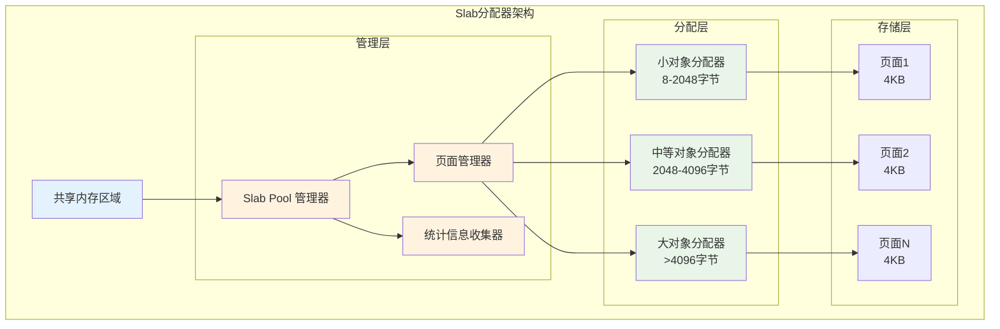
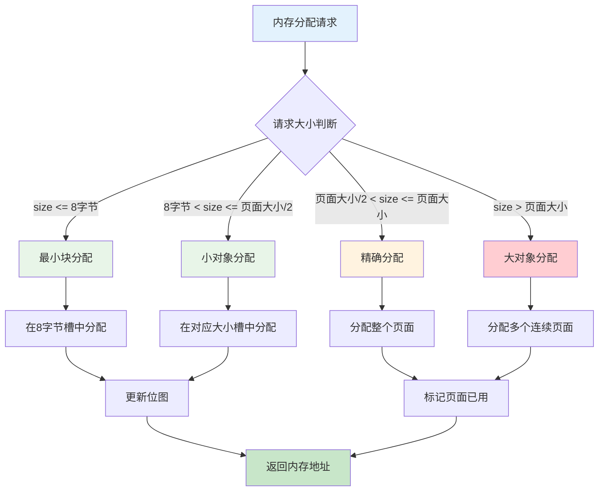
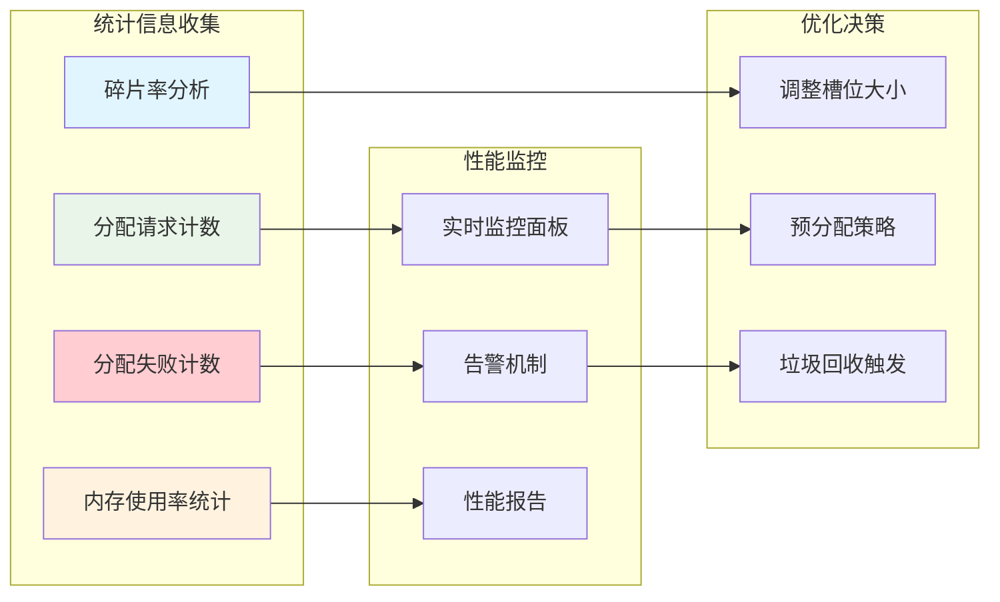

# Nginx 共享内存 Slab 分配器深度解析

## 概述

Slab分配器是nginx共享内存管理的核心组件，它在共享内存之上实现了高效的内存分配和管理机制。本文将深入分析Slab分配器的设计原理、数据结构、算法实现以及性能优化策略。

## 1. Slab分配器的设计理念

### 1.1 传统内存分配的挑战

在共享内存环境中，传统的内存分配方式面临以下挑战：

**内存碎片问题**：频繁的分配和释放会产生大量小的内存碎片，降低内存利用率。

**分配效率问题**：每次分配都需要搜索合适大小的空闲块，在高并发环境下效率低下。

**同步开销问题**：多进程环境下需要复杂的同步机制来保证分配操作的原子性。

**缓存局部性问题**：随机的内存分配模式可能导致CPU缓存命中率降低。

### 1.2 Slab分配器的解决方案

nginx的Slab分配器采用了经典的Slab算法，通过以下策略解决上述问题：



**分级管理策略**：将内存按照不同大小的块进行预分配，减少搜索时间。

**页面级组织**：以页面（通常4KB）为基本单位管理内存，便于统一管理。

**缓存行对齐**：考虑CPU缓存行大小，优化内存访问性能。

**统计驱动优化**：维护详细的分配统计信息，支持性能监控和调优。

## 2. 核心数据结构详解

### 2.1 Slab内存池结构

`ngx_slab_pool_t`是Slab分配器的核心数据结构，它管理整个共享内存区域的分配：

```c
// Slab内存池结构体 - 位置：src/core/ngx_slab.h
typedef struct {
    ngx_shmtx_sh_t    lock;         // 共享内存锁结构
    
    size_t            min_size;     // 最小分配单位（通常为8字节）
    size_t            min_shift;    // 最小分配单位的位移值（3，即2^3=8）
    
    ngx_slab_page_t  *pages;        // 页面描述符数组
    ngx_slab_page_t  *last;         // 最后一个页面描述符
    ngx_slab_page_t   free;         // 空闲页面链表头
    
    ngx_slab_stat_t  *stats;        // 各种大小块的统计信息数组
    ngx_uint_t        pfree;        // 空闲页面数量
    
    u_char           *start;        // 可分配内存区域起始地址
    u_char           *end;          // 可分配内存区域结束地址
    
    ngx_shmtx_t       mutex;        // 分配操作互斥锁
    
    u_char           *log_ctx;      // 日志上下文信息
    u_char            zero;         // 零字节（用于字符串结束）
    
    unsigned          log_nomem:1;  // 内存不足时是否记录日志
    
    void             *data;         // 用户数据指针
    void             *addr;         // 内存池基地址
} ngx_slab_pool_t;
```

### 2.2 页面描述符结构

每个内存页面都有对应的描述符，用于记录页面的使用状态和分配信息：

```c
// 页面描述符结构体 - 位置：src/core/ngx_slab.h
struct ngx_slab_page_s {
    uintptr_t         slab;         // 页面类型和分配位图信息
    ngx_slab_page_t  *next;         // 链表中的下一个页面
    uintptr_t         prev;         // 链表中的前一个页面（包含类型信息）
};
```

`slab`字段是一个多用途字段，根据页面类型存储不同的信息：

- **空闲页面**：存储连续空闲页面的数量
- **小对象页面**：存储分配位图，每个位表示一个小块的分配状态
- **大对象页面**：存储对象大小信息

### 2.3 统计信息结构

Slab分配器维护详细的统计信息，用于性能监控和调优：

```c
// 分配统计信息结构体 - 位置：src/core/ngx_slab.h
typedef struct {
    ngx_uint_t        total;        // 该大小块的总数量
    ngx_uint_t        used;         // 已使用的块数量
    ngx_uint_t        reqs;         // 分配请求总数
    ngx_uint_t        fails;        // 分配失败次数
} ngx_slab_stat_t;
```

## 3. 分配算法实现

### 3.1 分配策略概述

Slab分配器根据请求的内存大小采用不同的分配策略：



### 3.2 小对象分配实现

小对象分配是最复杂也是最常用的分配方式，它使用位图来管理页面内的小块：

```c
// 小对象分配实现 - 位置：src/core/ngx_slab.c
static void *ngx_slab_alloc_locked(ngx_slab_pool_t *pool, size_t size)
{
    size_t            s;
    uintptr_t         p, n, m, mask, *bitmap;
    ngx_uint_t        i, slot, shift, map;
    ngx_slab_page_t  *page, *prev, *slots;
    
    // 计算所需的块大小（向上取整到2的幂次）
    if (size > pool->min_size) {
        shift = 1;
        for (s = size - 1; s >>= 1; shift++) { /* void */ }
        slot = shift - pool->min_shift;
    } else {
        shift = pool->min_shift;
        slot = 0;
    }
    
    // 获取对应大小的槽位
    slots = ngx_slab_slots(pool);
    page = slots[slot].next;
    
    // 在现有页面中查找空闲块
    if (page->next != page) {
        
        if (shift < ngx_slab_exact_shift) {
            // 小块分配：使用位图管理
            bitmap = (uintptr_t *) ngx_slab_page_addr(pool, page);
            
            map = (ngx_pagesize >> shift) / (8 * sizeof(uintptr_t));
            
            for (n = 0; n < map; n++) {
                
                if (bitmap[n] != NGX_SLAB_BUSY) {
                    
                    for (m = 1, i = 0; m; m <<= 1, i++) {
                        if (bitmap[n] & m) {
                            continue;
                        }
                        
                        bitmap[n] |= m;  // 标记块为已使用
                        
                        i = (n * 8 * sizeof(uintptr_t) + i) << shift;
                        
                        p = (uintptr_t) bitmap + i;
                        
                        pool->stats[slot].used++;
                        
                        if (bitmap[n] == NGX_SLAB_BUSY) {
                            // 页面已满，从空闲链表中移除
                            for (n = n + 1; n < map; n++) {
                                if (bitmap[n] != NGX_SLAB_BUSY) {
                                    goto done;
                                }
                            }
                            
                            prev = ngx_slab_page_prev(page);
                            prev->next = page->next;
                            page->next->prev = page->prev;
                            
                            page->next = NULL;
                            page->prev = NGX_SLAB_SMALL;
                        }
                        
                        goto done;
                    }
                }
            }
        }
    }
    
    // 当前槽位没有可用页面，分配新页面
    page = ngx_slab_alloc_pages(pool, 1);
    if (page == NULL) {
        pool->stats[slot].fails++;
        return NULL;
    }
    
    // 初始化新页面
    if (shift < ngx_slab_exact_shift) {
        bitmap = (uintptr_t *) ngx_slab_page_addr(pool, page);
        
        n = (ngx_pagesize >> shift) / ((1 << shift) + sizeof(uintptr_t));
        
        if (n == 0) {
            n = 1;
        }
        
        /* "n" elements for bitmap, plus one requested */
        for (i = 0; i < (n + 1) / (8 * sizeof(uintptr_t)); i++) {
            bitmap[i] = NGX_SLAB_BUSY;
        }
        
        m = ((uintptr_t) 1 << ((n + 1) % (8 * sizeof(uintptr_t)))) - 1;
        bitmap[i] = m;
        
        map = (ngx_pagesize >> shift) / (8 * sizeof(uintptr_t));
        
        for (i = i + 1; i < map; i++) {
            bitmap[i] = 0;
        }
        
        page->slab = shift;
        page->next = &slots[slot];
        page->prev = (uintptr_t) &slots[slot] | NGX_SLAB_SMALL;
        
        slots[slot].next = page;
        
        pool->stats[slot].total += (ngx_pagesize >> shift) - n;
        
        p = ngx_slab_page_addr(pool, page) + (n << shift);
        
        pool->stats[slot].used++;
        
        goto done;
    }
    
done:
    
    ngx_log_debug1(NGX_LOG_DEBUG_ALLOC, ngx_cycle->log, 0,
                   "slab alloc: %p", (void *) p);
    
    return (void *) p;
}
```

这个分配算法的核心思想是：

1. **大小分类**：根据请求大小确定应该使用哪个槽位
2. **页面搜索**：在对应槽位中查找有空闲块的页面
3. **位图操作**：使用位图快速定位和标记空闲块
4. **页面管理**：当页面满时从链表中移除，空时重新加入

### 3.3 内存释放实现

内存释放需要根据地址反向确定块的大小和位置，然后更新相应的位图：

```c
// 内存释放实现 - 位置：src/core/ngx_slab.c
void ngx_slab_free_locked(ngx_slab_pool_t *pool, void *p)
{
    size_t            size;
    uintptr_t         slab, m, *bitmap;
    ngx_uint_t        i, n, type, slot, shift, map;
    ngx_slab_page_t  *slots, *page;

    ngx_log_debug1(NGX_LOG_DEBUG_ALLOC, ngx_cycle->log, 0,
                   "slab free: %p", p);

    // 检查地址是否在有效范围内
    if ((u_char *) p < pool->start || (u_char *) p > pool->end) {
        ngx_slab_error(pool, NGX_LOG_ALERT,
                       "ngx_slab_free(): outside of pool");
        goto fail;
    }

    // 根据地址计算页面索引
    n = ((u_char *) p - pool->start) >> ngx_pagesize_shift;
    page = &pool->pages[n];
    slab = page->slab;
    type = ngx_slab_page_type(page);

    switch (type) {

    case NGX_SLAB_SMALL:
        // 小对象释放
        shift = slab & NGX_SLAB_SHIFT_MASK;
        size = (size_t) 1 << shift;

        if ((uintptr_t) p & (size - 1)) {
            goto wrong_chunk;
        }

        n = ((uintptr_t) p & (ngx_pagesize - 1)) >> shift;
        m = (uintptr_t) 1 << (n % (8 * sizeof(uintptr_t)));
        n /= 8 * sizeof(uintptr_t);
        bitmap = (uintptr_t *)
                 ((uintptr_t) p & ~((uintptr_t) ngx_pagesize - 1));

        if (bitmap[n] & m) {
            slot = shift - pool->min_shift;

            if (page->next == NULL) {
                // 页面之前是满的，现在有空闲块了，加入链表
                slots = ngx_slab_slots(pool);

                page->next = slots[slot].next;
                slots[slot].next = page;

                page->prev = (uintptr_t) &slots[slot] | NGX_SLAB_SMALL;
                page->next->prev = (uintptr_t) page | NGX_SLAB_SMALL;
            }

            bitmap[n] &= ~m;  // 清除分配位

            n = (ngx_pagesize >> shift) / ((1 << shift) + sizeof(uintptr_t));

            if (n == 0) {
                n = 1;
            }

            i = n / (8 * sizeof(uintptr_t));
            m = ((uintptr_t) 1 << (n % (8 * sizeof(uintptr_t)))) - 1;

            if (bitmap[i] & ~m) {
                goto done;
            }

            map = (ngx_pagesize >> shift) / (8 * sizeof(uintptr_t));

            for (i = i + 1; i < map; i++) {
                if (bitmap[i]) {
                    goto done;
                }
            }

            // 页面完全空闲，释放页面
            ngx_slab_free_pages(pool, page, 1);

            pool->stats[slot].total -= (ngx_pagesize >> shift) - n;

            goto done;
        }

        goto chunk_already_free;

    case NGX_SLAB_EXACT:
        // 精确大小对象释放
        m = (uintptr_t) 1 <<
            (((uintptr_t) p & (ngx_pagesize - 1)) >> ngx_slab_exact_shift);
        size = ngx_slab_exact_size;

        if ((uintptr_t) p & (size - 1)) {
            goto wrong_chunk;
        }

        if (slab & m) {
            slot = ngx_slab_exact_shift - pool->min_shift;

            if (slab == NGX_SLAB_BUSY) {
                // 页面之前是满的，现在有空闲块了
                slots = ngx_slab_slots(pool);

                page->next = slots[slot].next;
                slots[slot].next = page;

                page->prev = (uintptr_t) &slots[slot] | NGX_SLAB_EXACT;
                page->next->prev = (uintptr_t) page | NGX_SLAB_EXACT;
            }

            page->slab &= ~m;  // 清除分配位

            if (page->slab) {
                goto done;
            }

            // 页面完全空闲，释放页面
            ngx_slab_free_pages(pool, page, 1);

            pool->stats[slot].total -= 8 * sizeof(uintptr_t);

            goto done;
        }

        goto chunk_already_free;

    case NGX_SLAB_BIG:
        // 大对象释放
        shift = slab & NGX_SLAB_SHIFT_MASK;
        size = (size_t) 1 << shift;

        if ((uintptr_t) p & (size - 1)) {
            goto wrong_chunk;
        }

        m = (uintptr_t) 1 << ((((uintptr_t) p & (ngx_pagesize - 1)) >> shift)
                              + NGX_SLAB_MAP_SHIFT);

        if (slab & m) {
            slot = shift - pool->min_shift;

            if (page->next == NULL) {
                slots = ngx_slab_slots(pool);

                page->next = slots[slot].next;
                slots[slot].next = page;

                page->prev = (uintptr_t) &slots[slot] | NGX_SLAB_BIG;
                page->next->prev = (uintptr_t) page | NGX_SLAB_BIG;
            }

            page->slab &= ~m;

            if (page->slab & NGX_SLAB_MAP_MASK) {
                goto done;
            }

            ngx_slab_free_pages(pool, page, 1);

            pool->stats[slot].total -= ngx_pagesize >> shift;

            goto done;
        }

        goto chunk_already_free;

    case NGX_SLAB_PAGE:
        // 整页对象释放
        if ((uintptr_t) p & (ngx_pagesize - 1)) {
            goto wrong_chunk;
        }

        if (!(slab & NGX_SLAB_PAGE_START)) {
            ngx_slab_error(pool, NGX_LOG_ALERT,
                           "ngx_slab_free(): page is already free");
            goto fail;
        }

        if (slab == NGX_SLAB_PAGE_BUSY) {
            ngx_slab_error(pool, NGX_LOG_ALERT,
                           "ngx_slab_free(): pointer to wrong page");
            goto fail;
        }

        size = slab & ~NGX_SLAB_PAGE_START;

        ngx_slab_free_pages(pool, page, size);

        ngx_slab_junk(p, size << ngx_pagesize_shift);

        return;
    }

    /* not reached */

    return;

done:

    pool->stats[slot].used--;

    ngx_slab_junk(p, size);

    return;

wrong_chunk:

    ngx_slab_error(pool, NGX_LOG_ALERT,
                   "ngx_slab_free(): pointer to wrong chunk");

    goto fail;

chunk_already_free:

    ngx_slab_error(pool, NGX_LOG_ALERT,
                   "ngx_slab_free(): chunk is already free");

fail:

    return;
}
```

## 4. 性能优化策略

### 4.1 缓存行对齐优化

Slab分配器考虑了CPU缓存行的影响，通过对齐优化来提高内存访问性能：

```c
// 缓存行对齐计算 - 位置：src/core/ngx_slab.c
void ngx_slab_sizes_init(void)
{
    ngx_uint_t  n;

    ngx_slab_max_size = ngx_pagesize / 2;
    ngx_slab_exact_size = ngx_pagesize / (8 * sizeof(uintptr_t));

    for (n = ngx_slab_exact_size; n >>= 1; ngx_slab_exact_shift++) {
        /* void */
    }
}
```

### 4.2 统计信息驱动的优化

通过维护详细的统计信息，Slab分配器可以进行性能监控和调优：


```
