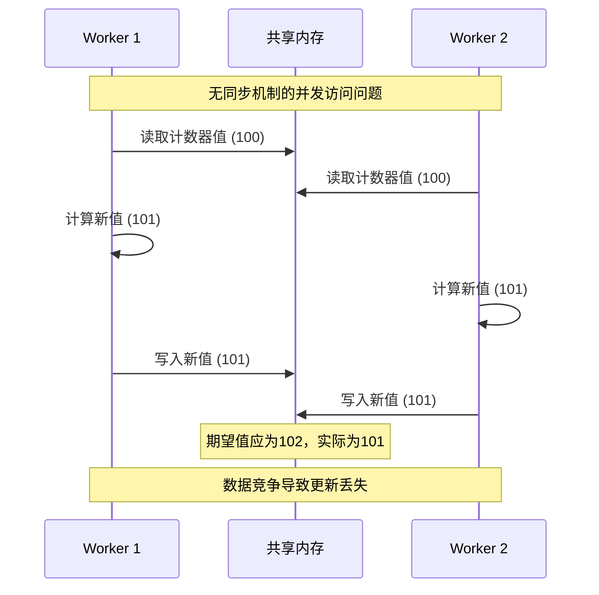
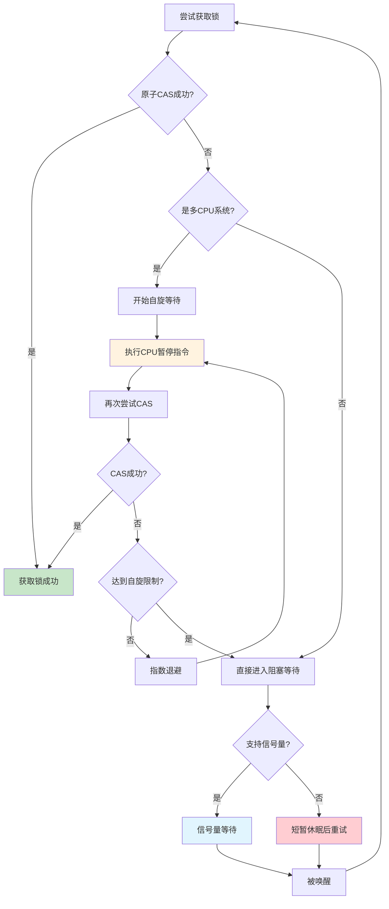

# Nginx 共享内存同步机制深度解析

## 概述

在多进程环境中，共享内存的并发访问控制是确保数据一致性和系统稳定性的关键。nginx实现了一套完整的共享内存同步机制，包括原子操作、互斥锁、自旋锁等多种同步原语。本文将深入分析这些同步机制的实现原理和应用场景。

## 1. 同步机制的必要性分析

### 1.1 并发访问的挑战

在nginx的多worker进程架构中，共享内存面临以下并发访问挑战：

**竞态条件（Race Condition）**：多个进程同时修改共享数据可能导致数据不一致。

**原子性问题**：复合操作（如读-修改-写）需要保证原子性执行。

**可见性问题**：一个进程的修改需要及时对其他进程可见。

**死锁风险**：不当的锁使用可能导致进程间相互等待。



### 1.2 nginx的同步策略

nginx采用了分层的同步策略来解决这些问题：

**硬件级同步**：利用CPU提供的原子指令实现无锁操作。

**操作系统级同步**：使用信号量、文件锁等系统调用。

**应用级同步**：实现自旋锁、读写锁等高级同步原语。

**算法级优化**：通过无锁算法减少同步开销。

## 2. 原子操作实现

### 2.1 原子操作的基础

nginx的原子操作基于CPU提供的原子指令，主要包括：

```c
// 原子类型定义 - 位置：src/core/ngx_atomic.h
typedef volatile ngx_uint_t  ngx_atomic_uint_t;
typedef volatile ngx_int_t   ngx_atomic_int_t;

#if (NGX_PTR_SIZE == 8)
typedef volatile uint64_t    ngx_atomic_t;
#else
typedef volatile uint32_t    ngx_atomic_t;
#endif
```

### 2.2 核心原子操作

nginx实现了一系列原子操作函数，这些函数在不同平台上有不同的实现：

```c
// 原子比较交换操作 - 位置：src/core/ngx_atomic.h
static ngx_inline ngx_atomic_uint_t
ngx_atomic_cmp_set(ngx_atomic_t *lock, ngx_atomic_uint_t old,
    ngx_atomic_uint_t set)
{
#if (NGX_HAVE_GCC_ATOMIC)
    // GCC内置原子操作
    return __sync_bool_compare_and_swap(lock, old, set);
    
#elif defined(__x86_64__)
    // x86_64汇编实现
    u_char  res;
    
    __asm__ volatile (
        "    lock;               "
        "    cmpxchgq  %3, %1;   "
        "    sete      %0;       "
        
        : "=a" (res) : "m" (*lock), "a" (old), "r" (set) : "cc", "memory");
    
    return res;
    
#elif defined(__i386__)
    // i386汇编实现
    u_char  res;
    
    __asm__ volatile (
        "    lock;               "
        "    cmpxchgl  %3, %1;   "
        "    sete      %0;       "
        
        : "=a" (res) : "m" (*lock), "a" (old), "r" (set) : "cc", "memory");
    
    return res;
    
#else
    // 其他平台的实现
    if (*lock == old) {
        *lock = set;
        return 1;
    }
    
    return 0;
#endif
}

// 原子获取并增加操作
static ngx_inline ngx_atomic_int_t
ngx_atomic_fetch_add(ngx_atomic_t *value, ngx_atomic_int_t add)
{
#if (NGX_HAVE_GCC_ATOMIC)
    return __sync_fetch_and_add(value, add);
    
#elif defined(__x86_64__)
    __asm__ volatile (
        "    lock;               "
        "    xaddq     %0, %1;   "
        
        : "+r" (add), "+m" (*value) : : "cc", "memory");
    
    return add;
    
#elif defined(__i386__)
    __asm__ volatile (
        "    lock;               "
        "    xaddl     %0, %1;   "
        
        : "+r" (add), "+m" (*value) : : "cc", "memory");
    
    return add;
    
#else
    ngx_atomic_int_t  old;
    
    old = *value;
    *value += add;
    
    return old;
#endif
}
```

### 2.3 内存屏障

为了确保内存操作的顺序性，nginx使用内存屏障：

```c
// 内存屏障实现 - 位置：src/core/ngx_atomic.h
#if (NGX_HAVE_GCC_ATOMIC)
#define ngx_memory_barrier()    __sync_synchronize()

#elif defined(__x86_64__) || defined(__i386__)
#define ngx_memory_barrier()    __asm__ volatile ("" ::: "memory")

#else
#define ngx_memory_barrier()    /* void */
#endif

// CPU暂停指令（用于自旋等待）
#if defined(__x86_64__) || defined(__i386__)
#define ngx_cpu_pause()         __asm__ ("pause")
#else
#define ngx_cpu_pause()         /* void */
#endif
```

## 3. 共享内存互斥锁

### 3.1 互斥锁结构设计

nginx的共享内存互斥锁支持多种实现方式，根据平台能力自动选择：

```c
// 共享内存互斥锁结构 - 位置：src/core/ngx_shmtx.h
typedef struct {
#if (NGX_HAVE_ATOMIC_OPS)
    ngx_atomic_t  *lock;        // 原子锁变量指针
#if (NGX_HAVE_POSIX_SEM)
    ngx_atomic_t  *wait;        // 等待进程计数器
    ngx_uint_t     semaphore;   // 是否使用信号量
    sem_t          sem;         // POSIX信号量
#endif
#else
    ngx_fd_t       fd;          // 文件锁描述符
    u_char        *name;        // 锁文件名
#endif
    ngx_uint_t     spin;        // 自旋次数限制
} ngx_shmtx_t;

// 共享内存中的锁数据结构
typedef struct {
    ngx_atomic_t   lock;        // 锁状态变量
#if (NGX_HAVE_POSIX_SEM)
    ngx_atomic_t   wait;        // 等待计数
#endif
} ngx_shmtx_sh_t;
```

### 3.2 锁的获取机制

nginx的互斥锁实现了一个复杂的获取机制，结合了自旋等待和信号量阻塞：



```c
// 互斥锁获取实现 - 位置：src/core/ngx_shmtx.c
void ngx_shmtx_lock(ngx_shmtx_t *mtx)
{
    ngx_uint_t         i, n;

    ngx_log_debug0(NGX_LOG_DEBUG_CORE, ngx_cycle->log, 0, "shmtx lock");

    for ( ;; ) {

        // 尝试原子获取锁
        if (*mtx->lock == 0 && ngx_atomic_cmp_set(mtx->lock, 0, ngx_pid)) {
            return;
        }

        // 多CPU系统上进行自旋等待
        if (ngx_ncpu > 1) {

            for (n = 1; n < mtx->spin; n <<= 1) {

                // 指数退避自旋
                for (i = 0; i < n; i++) {
                    ngx_cpu_pause();
                }

                if (*mtx->lock == 0
                    && ngx_atomic_cmp_set(mtx->lock, 0, ngx_pid))
                {
                    return;
                }
            }
        }

#if (NGX_HAVE_POSIX_SEM)

        if (mtx->semaphore) {
            // 增加等待计数
            (void) ngx_atomic_fetch_add(mtx->wait, 1);

            // 再次尝试获取锁（避免信号量丢失）
            if (*mtx->lock == 0 && ngx_atomic_cmp_set(mtx->lock, 0, ngx_pid)) {
                (void) ngx_atomic_fetch_add(mtx->wait, -1);
                return;
            }

            ngx_log_debug1(NGX_LOG_DEBUG_CORE, ngx_cycle->log, 0,
                           "shmtx wait %uA", *mtx->wait);

            // 在信号量上等待
            while (sem_wait(&mtx->sem) == -1) {
                ngx_err_t  err;

                err = ngx_errno;

                if (err != NGX_EINTR) {
                    ngx_log_error(NGX_LOG_ALERT, ngx_cycle->log, err,
                                  "sem_wait() failed while waiting on shmtx");
                    break;
                }
            }

            ngx_log_debug0(NGX_LOG_DEBUG_CORE, ngx_cycle->log, 0,
                           "shmtx awoke");

            continue;
        }

#endif

        // 短暂休眠后重试
        ngx_sched_yield();
    }
}
```
